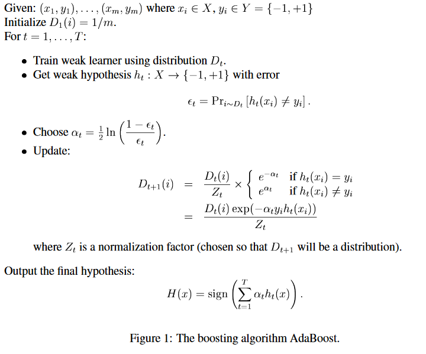

# CV Summary

This file was empty at the start of the Lernphase and grew with my knowledge. It is supposed to be

* A useful knowledge base for myself. Because everything is worded in a way I get, and all the related information is in one place.
* Potentially useful for future years' students of the Computer Vision lecture at ETH, to get an overview over the topics.

There could be mistakes, but I tried to mark the places where I am uncertain well.

* *Italic Titles are unfinished learning*
* ==Q== and ==TODO== denote less-important uncertainties/questions and more important todos, respectively.
* Self-Q and Self-A mean I asked and answered that question myself.

Best viewed in typora. State of this file: exactly as little or much as I was prepared for the exam.

#### Table Of Contents
[TOC]

## Homogeneous Math

Line intersects point: dot product
Point intersects point: cross product
Line intersects line: cross product

Are all "tests" if something intersects dot products and all "constructions" cross products? I think so, just because of dimensionality..

#### Line in 2D

$\ell(x) :\quad ax+by+c = 0\quad:\quad [\matrix{a&b&c}]\left[\matrix{x\\y\\1}\right]=0$

So the line is represented by $a, b, c$. A point $(x, y, 1)$ intersects the line if $\ell^T \vec p = 0$.

#### Intersection of Lines

$$
[\matrix{a&b&c}] \cdot p = 0 = [\matrix{d&e&f}]\cdot p
$$

so $\vec p$ is orthogonal to both line-describing vectors. Hence the intersection is $x \mathbin{:=} \left[\matrix{a\\b\\c}\right]\cross\left[\matrix{c\\d\\e}\right]$.

In the special case of parallel lines, the intersection will have a $0$ in the third axis - so the point at infinity.

#### "Intersection" of two Points

Similarly to before, if we have $\ell \cdot p_1 = 0 = \ell \cdot p_2$ then $\ell \mathbin{:=} p_1 \cross p_2$ contains both points. Because $\ell$ is orthogonal to both points, and hence for both points the equation is zero.

#### Horizon

The same special case can not happen with lines... unless both points are at infinity. Then the first two entries of the line representing vector are $0$. In that case, only the third entry is nonzero. We usually describe the line at infinity (containing all points at infinity) as $\left[\matrix{0&0&1}\right]^T$. That is equal to any other factor in the last coordinate because any point at infinity can be rescaled (like all points can be) and the line still goes through it.

#### Line from Point + Slope

Given a Point and a slope. We want a line that the point lies on - this is given by computing the line as $\ell = \text{point} \cross \text{something}$ because then $\ell\perp \text{point}$ no matter what $\text{something}$ is.

To fulfill the slope part, only $\ell_x, \ell_y$ are relevant. The need to fulfill $\text{slope} = {\ell_y \over \ell_x}$. Which is given when the $\text{something}_z$ entry is $0$ (and $\text{point}_z \neq 0$). It is easy to verify but not so easy to derive.

So if it's $(a,b,0)$ it is a slope, if it is $(a,b, \cancel 0)$ it is a point.

(How) can I test if a line has a specific slope?
I guess I just read it off the line's entries. But can I also do it with a multiplication? I think so. the check is if $\ell^T\cdot \text{slope} = 0$

#### Parallel Lines Intersection continuing use

Self-Q: What happens when a false point (intersection of two parallel lines) is propagated? E.g. a line through it and another valid point.. would give some line. How does that line look like?

Self-A: That just works out. The point of intersection is the one at infinity *in the direction of the parallel lines* and thus works as a slope and can be used to build a new line.

It's alright that the slope ends in zero, because that's what slopes do. It's also okay if even the resulting line ends in zero, as that is just it's shift - it does not have to be normalizable to one.

#### Points and Planes in 3D

Points and Planes in 3D use 4 coordinates. $\pi^T = (x, y, z, \text{offset})$ for the plane. If a plane contains a point, $\pi^T p = 0$.

#### Dual Plane in 3D

Points and Planes are dual in 3d, much like Points and Lines are in 2d.
A point is the intersection of three planes, and a plane is the construction from three points.

A Plane can be represented by linear combinations of three distinct points on it and their linear combinations, describing any point on it. $p = M \left(\matrix{s_1\\s_2\\s_3}\right)$.

A point can also be described as the intersection of three planes. $\begin{bmatrix}\pi_1^T\\\pi_2^T\\\pi_3^T\end{bmatrix} p = 0$.

By inserting $p$ from the first representation we see that $\pi^T M = 0$, because the $s$ are sometimes nonzero. Thus, we can take the left nullspace of $M$ to get $\pi^T$ - or the right nullspace of $\pi^T$ to get $M$. 

So a plane can be either represented by three points $M$, or by $\pi^T = (x,y,z,\text{offset})$

#### Lines in 3D

> Homogeneous representation for 3D lines is not as straightforward as it is for 3D points and planes in 3D. A 3D line has **four** DoF so ideally we would use a 5d representation. That would be incompatible with the rest though.
> [Rephrased from (https://engineering.purdue.edu/kak/computervision/ECE661Folder/Lecture6.pdf)]

We can represent a line as a combination of two points, or as a linear combination of planes.

The two points you choose for the explicit representation should lie on the two planes you choose for the implicit representation (obviously, because they lie on the line). So they should fulfill the plane equation. $[\text{planes}]\cdot [\text{points}] = 0_{2\times2}$:
$$
\begin{bmatrix}
A^T\\B^T
\end{bmatrix} \begin{bmatrix}
P & Q
\end{bmatrix}
\stackrel{\&}{=} 0_{2\times2} \stackrel{\&}{=}
\begin{bmatrix}
P^T\\Q^T
\end{bmatrix} \begin{bmatrix}
A & B
\end{bmatrix}
$$

Because of this, we can go back and forth between the representations.

Notice that the order in the equation does not matter, as long as one of the factors is transposed such that the result is a 2x2 matrix and not a scalar. $A, B$ are column vectors representing the points, $P,Q$ are column vectors representing the planes.

Both representations result in the same line, a parametric $\lambda A + \mu B$  or $\gamma P + \delta Q$.

#### Backprojecting Points in 3D

We can backproject lines from image space to planes in 3d space by doing $P^T \ell$. But we can **not** do the same for **points** because the shapes of lines don't work out. But we can simply construct the line from the image and camera point world coordinates. That requires computing the world coordinates.

We can also treat the image point as the intersection of a line in the x-dimension and a line in the y-dimension in the image. Backproject those lines, then intersect the found planes in 3d:
$$
x = p_x \Rightarrow 0 = p_x - x \Rightarrow \ell_x = \begin{bmatrix}-1\\0\\p_x\end{bmatrix}\label{backproplinex}
$$
This is a vertical line, since $x$ is fixed and $y$ variable on the line. We create a horizontal line $\left[\matrix{0\\-1\\y}\right]$ in the same way. We get the planes with $P^T\ell_x$ and $P^T\ell_y$ and then stack them to build a 3d line.

See also https://engineering.purdue.edu/kak/computervision/ECE661Folder/Lecture17.pdf for arguing about backprojecting points and that the camera center is weird.

##### Backprojection of a Line

> Q: Is a projection matrix really always invertible by transposing it like I do here?
>
> A: That works because we have for points that $x_{2d} = Px_{3d}$ and a point in 3d is on a plane if $x^T_{3d}\pi =0$. Combining those, we get for the plane-to-line projection that the line $x^T_{2d}\ell  =0$ fulfills $\ell = P^{-T}\pi$ and thus the backprojection is using $P^T$.

$$
x^T_{3d}\pi = 0 \text{ because x lies on the plane in 3d}\\
\Rightarrow x_{3d}^TP^TP^{-T}\pi= x_{2d}^TP^{-T}\pi =0\\ \text{ (because we want to get x to 2d)}\\
\text{We know: }x_{2d} =Px_{3d} \text{ and } x_{2d}^T\ell=0\\
\Rightarrow x_{2d}^TP^{-T}\pi=0=x_{2d}^T\ell\\
\Rightarrow \ell=P^{-T}\pi\label{eqbackpropline}
$$

Note: Even though we can project a point with $x_{2d}=Px_{3d}$, we can not do the opposite to get the ray: $\cancel{x_{3d}=P^{-1}x_{2d}}$ because the inverse does not exist for a $(3\times4) \;P$ and the pseudoinverse would map to one 4d-vector, which is not a line representation in 3d. So it can not give us a line.
Thus $\text{Eq. }\ref{eqbackpropline}$ is possibly not a valid proof as it makes use of the inverse.
$$
\text{points on a 2d line: }x^T\ell = 0\\
\text{Projection of point to 2d: }PX=x\\
\text{projected x is in the line in 2d: }(PX)^T\ell = 0\\
\text{\qquad equal to }X^TP^T\ell=0\\
\text{Plane in 3d must be } X^T\pi=0 \Rightarrow \pi = P^T\ell\label{eqbackpropline2}
$$

#### Intersecting lines with planes in 3d is hard

Basically we first get the dual line representation ($\left[\matrix{a_1 & a_2 & a_3 & a_4 \\b_1 & b_2 & b_3 & b_4}\right]$) (usually by solving for the right null-space with SVD) where the rows are planes. And then we add as a third row the plane $\pi$ we want to intersect with our line. set the whole thing equal to $\vec0_{4\times1}$ and then choose $w=1$ and solve the system:

[Source](./Lecture6purdue.pdf) from https://engineering.purdue.edu/kak/computervision/ECE661Folder/Lecture6.pdf

#### Parallel Lines Intersection in 3D

Self-Q: What does it mean in 3d when we intersect two lines that are not concurrent but also not parallel? I assume we get a point in infinity... but which one? 
Can I run a computation afterwards on a real point and the infinite point and get a line again? If yes, what is its direction?

Self-A: I... guess not. I would probably take three of the four plane equations in the two dual lines (plane representation) and solve the same system as [above](#Intersecting-lines-with-planes-in-3d-is-hard), then do it again and check if the two resulting points are the same.

#### Conics

I guess this is synonymous to a Conic Section (circle, ellipse, hyperbola, parabola).

A quadric would be the same, but not just a section in 2D, but in 3D (or more) I think.

A conic going through a point is defined by $ax^2 + bxy + cy^2 + dx + ey + f = 0$ and with five points we can define where it is.

[Source](https://link.springer.com/content/pdf/bbm%3A978-0-85729-046-5%2F1.pdf) . Because the equation is independent of scale (equal to zero), it has only 5 DoF, so we only need 5 points to define the conic. Placing the conic coefficients in $\mathbf c$, we have thus 

and can solve it for $\vec c$.

#### Tangent to a Conic

Given a conic and a point. Denote $P^T$ the matrix with rows $p^T$ from above and $C$ the alternative represenation ($\mathrm {Eq.\ }A.8$).

In the $C$-representation:
Let $x \mathop{:=} \left(\matrix{x_1 \\ x_2 \\ x_3}\right)$ be a 2d-point in homogeneous coordinates.
The point lies on the conic, so $x^TCx = 0$.
The point lies on the tangent $\ell$, so $\ell^T x = x^T\ell = 0$.
Thus $\ell = Cx$.

#### Conic Duality

We can define a conic with points on it $(x^TCx = 0)$ but we can also define it with tangent lines around it $(\ell^T C^\star\ell)=0$.

This works because with the tangent line definition $\ell = Cx$ the dual definition is $x^T C^T C^\star C x$ and with a full-rank $C$ we use $C^\star \mathop {:=} C^{-1}$ so $0=x^TC^\star x$. The transpose disappears because $C$ is symmetric. We assumed that $x$ is the tangent point (in the tangent line definition). 
So the dual conic, using the lines, uses the (pseudo-)inverse.

#### Degenerate Conics

A degenerate conic is [just two lines](https://en.wikipedia.org/wiki/Degenerate_conic) in 2d. That happens if $C$ is not full rank. Those happen when the tangent lines are at infinity. The dual **does not exist here**.
Generally though, $C^\star$ is symmetric, as $C$ is also, and the inverse of a symmetric matrix is symmetric.

$C$ can be written as symmetric matrix. If the rank is only 2 it might be two **lines**. Then we can write $C=l m^T + m l^T$.  Which still works because $x^T C x = 0$ applies for any **point** on one of the lines, as $l^T x = 0$ (or $m^T x = 0$). If the point is on $l$ then $x^Tlm^T x+ x^Tml^Tx = 0$, same for on $m$. This is also a general decomposition of a symmetric rank 2 matrix.

The degenerate conic could also be a single line (rank 1). Then $C = ll^T$. Same argument but it's zero from the left, and zero from the right.

In the dual representation $\ell^T C^* \ell=0$ we do the same to have two **points** (if rank 2) or one double point (if rank 1). Because $\ell^T l m^T \ell + \ell^T m l^T \ell = 0$ is fulfilled when the tangent **line** $\ell$ is tangential to either of the *points* $m$ and/or $l$. Meaning either $m$ or $l$ simply lie on $\ell$. So $\ell^T m = 0$ or $\ell^T l = 0$.

We can not switch representations in the degenerate cases, because $C^\star \leftrightarrow C$ is not possible.

And what the conics are good for...? Calibration, it was claimed.
Another example is simply computing with them. You have a circle (conic) in an image and you want the 3d cone that contains this circle, originating from the camera point? Well, simply do $Q =P^TCP$ with a known projection matrix $P$ and you get the 3d quadric $Q$:

For projecting the quadric to a conic, they use the dual quadric though, because that one is defined by planes and backprojecting planes is "very easy" compared to backprojecting points.

For these, I like to think of a conic as a function that takes a point and checks whether it lies on the conic. So this quadric is just a wrapper that transforms the points before and after ... or the planes, in the second case.

==Q==: Can there be multiple degenerate rank-2 conics that describe two points at infinity or is that unique?

#### Quadrics

I believe they are 3d "stacks" of conics. The structure is similar:

* $X^TQX = 0$, but this time $Q$ is $(4 \times 4)$. It has $\mathbf 9$ degrees of freedom
* It's 9 DoF because $\text{size}(\{x^2, y^2,z^2,\Xi^2, xy, xz, x\Xi, yz, y\Xi,z\Xi\})=10$ but the equation is only up to scale as it is equal to zero, so we subtract one DoF.
* Like $Cx$ yields a tangent line, $Qx$ yields a tangent *plane* (if $x$ lies indeed on the quadric).
* As long as the quadric is not degenerate (i.e. the matrix $Q$ has full rank, i.e. iff not det Q = 0) a dual representation exists. It describes the quadric using tangent planes instead of points: $\pi^TQ^\star \pi = 0$

#### Circular Points

Also called isotropic points or cyclic points. Are *two* special points at infinity. 
Any line going through them is called an *isotropic line*.
$$
(1, \mathrm i, 0) \text{ and } (1, -\mathrm i, 0)
$$
These lie on the "complexification" of every real circle. The complexification is obtained by taking the homogeneous circle equation and taking all complex solutions. So in other words, the circular points are a solution to every circle of the form
$$
x^2 + y^2 + 2axz + 2byz + cz^2 = 0
$$
Which makes sense, because $z=0$ so all that has to hold is $x^2+y^2=0$, and we know $1^2 + \mathrm i^2 = 0$ indeed.

Other solutions at infinity are the same points, up to scale.

Under Similarity Transforms (only scale, rotate, translate), they are invariant.

We know that the rank-2 degenerate conics can be either two lines ($x^TCx=0$) or two points ($\ell^TC\ell=0$). (See [Degenerate Conics](#Degenerate-Conics): a degenerate conic that operates on points is lines, and vice-versa).
To compute the conic at infinity that is just the two circular points $\mathbf I, \mathbf J$, we hence follow that section and do $C_\infty^\star \mathop{:=} \mathbf I \mathbf J^T + \mathbf J \mathbf I^T =\begin{bmatrix}1&0&0\\0&1&0\\0&0&0\end{bmatrix}$. 

Applying any homography to $C_\infty^\star$ ... The way to apply such a homography is discussed further below and is for dual conics ${C^\star}' = HC^\star H^{T}$. So it follows that only if $H$ is a Similarity will this conic be fixed - and thus also the two circular points. That works for Similarities because the zeros of $C_\infty^\star$ wipe out the translational part of $H$ and the rotational part of $H$ is orthonormal, so can be undone with $H^T$. The scaling is irrelevant in points in infinity.

#### Angles in 2D

Angles in Euclidean Space: Normalize the vectors and then the dot product is the cosine:
$$
\cos \theta = \frac{\vec u}{\|\vec u \|} \cdot \frac{\vec v}{\|\vec v\|}
$$

In projective space: If we know the absolute dual conic $C_\infty^\star$ (two circular points, at infinity) then we can compute $\cos \theta$, the angle between two directions. With lines $l, m$,
$$
\cos \theta = \frac{l^TC_\infty^\star m}{\sqrt{(l^TC_\infty^\star l)(m^TC_\infty^\star m)}}
$$

Lecture 2 Wednesday: 1: 19 :22 touched this only briefly, but [cis.upenn.edu](https://www.cis.upenn.edu/~jean/gma-v2-chap5.pdf) [pdf](./cis-upenn-edu-jean-gma-v2-chap5.pdf) covers it on p44.
The problem with lines is that they are not oriented - so multiple angles are correct.
We take the lines $D_1, D_2$ that intersect and we want to know the angle between them. Move the frame such that the intersection point lies at the origin and now these lines have no shift component ($z=0$, $ax+by=0$). The isotropic lines through the intersection point are called $D_I, D_J$ and constructed as $D_I = \mathbf I \times p = \begin{bmatrix}1\\\mathrm i\\0\end{bmatrix}\times\begin{bmatrix}p_1\\p_2\\p_3\end{bmatrix}=\begin{bmatrix}p_3\mathrm i\\-p_3\\p_2-p_1\mathrm i\end{bmatrix}\stackrel{p = \text{origin}}{=}\begin{bmatrix}\mathrm i\\-1\\0\end{bmatrix}$. Analogously, $D_J = \begin{bmatrix}\mathrm i \\1\\0\end{bmatrix}$.
We now choose *any* line not going through the intersection point $p$ and compute their [cross ratio](https://en.wikipedia.org/wiki/Cross-ratio), which is according to wikipedia "essentially the only projective invariant of a quadruple of collinear points". We take the points on $D_I$ and $D_J$ as $C$ and $D$ for the cross ratio.

| cross-ratio definition                       | visualization                                                |
| -------------------------------------------- | ------------------------------------------------------------ |
| $(A,B; C,D) = \frac{AC\cdot BD}{BC\cdot AD}$ |  |

Since $D_I$ and $D_J$ are always known, and we avoided the shift parts of $D_1$ and $D_2$, we get a formula to compute the cross-ratio that only depends on the slopes of $D_1$ and $D_2$ (even for infinite slopes or when $D_1 == D_2$). 
The final formula for the angle obtained in the pdf is not the same as from the lecture. (Probably because it operates with the circular points and not the absolute dual conic). I will just believe the lecture formula and trust that it was never the idea that I'd read any of this.

#### But Why Similarity?

> 

This quote has been posted in the discord, but I don't think it is incredibly useful. Also, the absolute conic is imo not an identity matrix... the last row is zeros only.

#### The Absolute Conic

Points on the **Plane** at infinity. This is for *3D*. It has no real points and can not be observed in an image. It is described by points, so is not a dual.

The absolute conic $\Omega_\infty$ is a fixed conic under the projective transformation iff it is a **similarity.**. though only as a set, not elementwise.
Each circle intersects $\Omega_\infty$ in two circular points. Each sphere intersects the plane at infinity in $\Omega_\infty$.

==Q==: I believe it describes two lines in infinity? Or is $\Omega_\infty$ not degenerate? Well, I guess it is a degenerate *quadric* but is still a valid conic on the plane at infinity... ?

#### The Absolute Dual Quadric

$\Omega_\infty ^*$ is a dual quadric. It contains all the tangent planes to the cone at infinity.

> Don't try to geometrically, intuitively understand or visualize this.
> It's just what rolls out of equations.

Preserving the absolute dual quadric is equivalent to having a **similarity**.

The absolute dual quadric has 8 degrees of freedom in general, and "the plane at infinity is a nullvector of it." (Not sure what this sentence meant.)

#### Angles in 3D

Similar to [Angles in 2D](#Angles-in-2d), but planes and the quadric, instead of lines and the conic.

## Normalizing (Point Clouds)

Always move the center of mass to the origin and scale it down to the [0,1] range. This is doable by constructing a matrix that does the opposite and inverting it. This takes the points in [0,1] range, scales them by sigma, and shifts the mean to our data mean:
$$
T = \begin{bmatrix}
\sigma_x & 0 & \mu_x \\ 0 & \sigma_y & \mu_y \\
0  & 0 & 1
\end{bmatrix} ^{-1}
$$

Reason for normalization: avoiding numerical issues due to big scale differences. And things like PCA would work better, but not sure that matters here.

## Camera Matrices and Projection styles

* calibration: how many measurements do we need, and why?
  Each measurement yields two constraints, so we need 3 measurements to fill the 5 DoF

  But why do we have 5 DoFs? Well, that is just the number of variables unknown in the pinhole projection matrix $K$.

* Fundamental Matrix
  * equation for mapping points: Depends on convention. $x'^TFx = 0$ is fulfilled for all corresponding points but also for other points that happen to be on the same epipolar line.
  * DoF and shape of Fundamental Matrix
    $F$ has 7 DoF and $E$ has 5. I think I have put the arguments about this further below.
  * ==Q== 2016: Why do we need eight correspondences to extract the fundamental matrix when the matrix only has seven degrees of freedom??? I guess because linear means we can not enforce the determinant constraint.

* Affine, Similarity, Projective Transformations
  * Under which of these groups are SIFT descriptors invariant?
    A: under similarities only. not affinities, not projectivities.
    ==Q==: Why?

### Pinhole Camera Model

The focal length $f$ is the distance of the image plane to the camera point. The equation takes a homogeneous 3d point and produces a homogeneous 2d point. The Z is preserved so that it ends up being a division (after normalization of the resulting 2d point).

The projection works with similarities: ${Z \over f}$ is equal to $Y\over y_{2d}$. So $y_{2d} = \frac{fY}{Z}$. Same for $X$.

If we want some translation that is added onto the 2d point, we can do that by adding it times Z (because of impeding implicit division by z). Since the fourth column is zeros anyway, we can apply this also to non-homogeneous 3d points.

We can also add rotation, and translation before the projection $K$ is applied. E.g. to shift the camera to the origin and rotate around the 3d camera position $\tilde C$.
$$
x = K R \left[\mathrm I \vert -\tilde C\right]\label{eqseven}
$$
To combine that into one matrix, the translation is rotated too and applied afterwards, rotating the point. Multiplying $\mathrm{Eq.}\ \ref{eqseven}$ out gives us a projection $P = K\left[R | -R\tilde C\right]$. We can add some skew $s$ into $K$ (adds $s Y$ to $X$).
$$
x = \underbrace{\begin{bmatrix}
\alpha_x & s & p_x \\ 0 & \alpha_y & p_y\\
0 & 0 & 1
\end{bmatrix}}_K

\begin{bmatrix}
R & | & \overbrace{-R\tilde C}^t \\
\matrix{0&0&0} & | & 1
\end{bmatrix}
$$

Notice that $K$ is upper diagonal - that can be a useful constraint.

#### Principal Point

What is the point of having a principal point to move around after the projection (p_x, p_y) ?

It's wherever the axis from the center of the lens happens to be in the image. That is usually close to the image center, but not exactly. A slight shift of a millimeter can be calibrated using this.

#### Focal Lengths differ?

How can focal length be different for $x$ and $y$? How does that make sense geometrically?

Well, the focal length $f$ is the same for both $x$ and $y$ direction, but there is also the "sampling rate: how many pixels per millimeters you have". So you map from something that is measured in space to something that is measured in pixels. These factors happen to also be on the first two diagonal elements.

Focal lengths have to be positive.

### Radial Distortion

A slightly different camera model: A spherical lens is relatively easy to produce but the incoming rays are slightly distorted - in a pinhole they would not. The line exiting the lens might have a slightly different direction based on the incoming angle. So the further away from the image center, the more we have distortion. That distortion is typically radially symmetric. We fix it by adding a *nonlinear function* between $K$ and $[\matrix{R | -R\tilde C}]$ that rescales the $x$ and $y$ coordinates based on their radius (or changes the focal length).

## Transformations

### Euclidean / Isometric Transforms

* Iso-metric = Same-Distance. Preserves the euclidean distance.
* preserves orientation or reverses it (mirrors) (if $r_{11}, r_{21}$ are multiplied by $-1$)
* preserves area and lengths
* Is basically a rotation and a translation. So in 2d 3 DoF: $(\theta, t_x, t_y)$
* $R + \vec t$

### Similarity

* There is scaling: lengths are not preserved, but their ratios.
* The [circular points](#Circular-Points) are invariant
* $s\cdot R + \vec t$

### Affinity

* must not strictly be a rotation+scale anymore
* $A + \vec t$
* Parallel lines remain parallel
* (not sure if lines that intersect remain necessarily intersecting? I believe they do, because the projectivity also features that.)
* Ratios of parallel lines' lengths are preserved (e.g. midpoint remains in the middle)
* different directional lines can be squashed differently
* Linear combinations of vectors are preserved - I.e. the centroid is still the centroid after the affine transform.
* The **line at infinity** remains the line at infinity. Not the points on it though, those might shift density.

### Projectivity

The most powerful / least constrained  of them all.

* preserves concurrency: Lines that intersect remain intersecting

* preserves collinearity: points on the same line remain collinear after the projectivity transform

* preserves order of contact (how strongly things touch):

  * 0th: a crossing, not tangent
  * 1st: the two curves are tangent
  * 2nd: the curvatures are equal in that point (e.g. circle in curve)
  * 3rd: 2nd derivative is equal too
  * 4th: 3rd derivative (2nd derivative of the curvature) is equal too

  | 1st                                              | 2nd                                                  | 3rd                                               |
  | ------------------------------------------------ | ---------------------------------------------------- | ------------------------------------------------- |
  |  |  |  |

* Also called **Homography**

### How To Apply Homographies

#### Point

$x' = Hx$

#### Line

$\ell' = H^{-T}\ell \Leftrightarrow \ell'^T=\ell^TH^{-1}$

If we map two points, we get the new line. Thus $\ell'^T x' = \ell'^T H x = 0$ for both points. So we choose $\ell' = H^{-T} \ell$ and get $\ell'^THx = (H^{-T}\ell)^THx = \ell^T x$. $\blacksquare$

#### 2d Line to 3d Plane (degenerate case)

See $\text{Eq. }\ref{eqbackpropline2}$: $\pi' = P^T\ell$ when $P$ is the projection for points.

#### Plane

$$
0 = \pi'^Tx' =\pi'^THx \stackrel!=\pi^Tx=0 \Rightarrow\pi'^T=\pi^TH^{-1}\\
\pi' =  H^{-T}\pi
$$

Note that this homography matrix is applied on the same side as it is for the line, but transposed.

#### Conics

$C' = H^{-T} C H^{-1}$

The points fulfill $x^TCx = 0 $. Which is $0 = x^TH^T H^{-T} C H^{-1}Hx = (x')^TH^{-T}CH^{-1} (x')$. $\blacksquare$

#### Dual Conics

${C^\star}' = HC^\star H^{T}$

The lines fulfill $\ell ^T C \ell = 0$. Which is $0= (H^{-T}\ell)^{T} \underbrace{H C H^{T}}_{C^\star} (H^{-T}\ell)$ $\blacksquare$

#### Quadrics

> When we have a plane that touches the quadric, the image of that will also be tangent in the projections (images). This actually gives you a constraint because that's not obvious.

### 3D

In 3D, the homographies are now $(4\times4)$. What held for lines holds for planes. What held for (dual) conics now holds for (dual) quadrics.

Same hierarchy: What are the 3d promises?

#### 3d: **Plane** in Infinity

Instead of a line at infinity, we now have a **plane**. It is invariant under affine transforms. It has a $1$ in the last coordinate and contains "directions".

The circular points are now instead a full absolute conic, and invariant under similarities. It is in the *plane* at infinity. All *spheres* intersected with the plane at infinity have this complex conic.

The **plane** at infinity is invariant under **Affinities**, just like the line at infinity is in 2d.
The **absolute conic** is invariant under **Similarities**, just like the circular points in 2d.

Two planes are parallel in 3d if the line of intersection lies in the plane at infinity. 
Self-Q: how does that look like in the numbers? Is the first coord of the line zero, or what?
Self-A: No! Lines in 3D are stacked planes or stacked points. So we would simply compute the line by representing as stacked planes, then solve for the null-space $4\times4$ matrix to get the line's non-dual representation with two points stacked inside, and see if they both have a zero in the last coordinate.

#### DoF

In 3d, the matrices are $(4\times4)$ instead of $(3\times 3)$ but the same logic applies in 2d as well. Which is that we simply count the number of elements in the matrix that are free.

##### Projective: 15 DoF

$3*3$ from $A$, $3$ from $t$, and only $3$ from the last row (because the scale is now also variable, but it does not matter to us at all).

##### Affine: 12 DoF

Like projectivity, but lowest row is fixed. So $3*3$ from $A$, $3$ from $t$.
Has no "perspective effect"

Affine projections preserve the center of mass. This can be useful to find a robust "common point" among multiple views.

##### Similarity: 7 DoF

Like Affine, but $A$ is a rotation Matrix $R$ plus a scale factor. Last row is predetermined.
$R \in (3\times3)$ has three rotational planes, so three DoF. $t$ has another three. $s$ is the final one.

##### Euclidean: 6 DoF

Just a rotation matrix $R$ but no scale factor. plus $t$. Last row is predetermined.

##### Multi-D DoF of Rotations (Irrelevant)

A rotation happens always *on a plane*. In 3d it also happens around an axis, but that is misleading. In Nd, we want to count the number of distinct orthogonal planes to rotate in - so ${N \choose 2}$, which happens to be $\frac{1}{2}N(N-1)$. Because you get $N$ choices for the first, $N-1$ for the second, and then divide by $2$ to make up for the duplicates in ordering. [Source](https://math.stackexchange.com/a/1281347/281166).

So in $2d$, $R$ has $1$ DoF, and in $3d$ it has $3$ DoF. (Not just $2$ in $3d$, because otherwise not all rotation paths could be achieved, only all rotation positions).

### Direct Linear Transform Q

We want to find $P$ knowing points in 3d and 2d. We know that $PX_i = x_i$ up to scale (because homogenous) so we use the cross product to state the equations. Because it is zero iff it is the same direction. $PX_i \times x_i = 0$. 

Since $x_i$ is representing two coordinates only, it is rank 2, so we get two equations for each point. We can represent the cross product operation $\left(\matrix{x\\y\\w}\right) \times \left(\matrix{a\\b\\c}\right)$ as
$$
[x_i]_\times \left(\matrix{a\\b\\c}\right) \mathrel{:=}
\begin{bmatrix}
yc - wb \\ wa-xc \\ xb - ay
\end{bmatrix} = \begin{bmatrix}
0 & -w & y \\
w & 0 & -x \\
-y & x & 0
\end{bmatrix}
\left(\matrix{a\\b\\c}\right)
$$
Knowing $X_i$, we can factor that part in. See further below. Now we have the known entries in a matrix and can simply stack constraints, then solve for the three rows of $P$.

Q: What about the possibility that we find a orthogonal point instead of a same point? isn't that possible in 2d, in homogeneous coords?
Self-A: For the cross product to be zero, $xb -ay$ has to be zero. if the vector is orthogonal (not equal though) then $b = -sx, \quad a = sy$ for some scale factor $s$ and thus $xb - ay = -sx^2 + sy^2$. Therefore only the $(0,0,1)$ point would fulfill this. But then $wa - xc \neq 0$ for non-infinite points. On the other hand, if $a=sx,\quad b=sy$ then $xb-ay = sxy - sxy = 0$.

##### Algebra (Resectioning, Cross-Product Matrix)

But how to "simply factor them in"? How to we algebraically reach the big matrix with the constraints?

From Hartley, the book, page 89: 

>  

In my own words:

We take a look at each row of the projection matrix seperately and write the full matrix of the cross product. We notice that each entry of $P X$ is a scalar, so instead of multiplying a row of $P$ with $X$ we may also transpose the two and swap their places (both are vectors, the scalar is the same). Doing this for each entry, we get $X$ to the left side of the rows of $P$ and can then multiply it into the matrix. The entries of the remaining vector are now no longer rows though, so it is a biig column vector.

It looks like they have 3d points in non-homogeneous coordinates but 2d points in homogeneous ones.

##### Questions

Self-Q: Why don't we use the dot product instead of the cross product? That should also represent the angle, no? 
Self-A: I guess because we need to normalize it then, which is more effort?

Q what was that about optimization requiring that the $p$ in $|Ap|=0$ is $|p|^2=1$?
A: [This video](https://youtu.be/GUbWsXU1mac?t=228). It's that the projection matrix is defined up to a scale factor. Might as well have fixed an element, but saying $\| p\|^2 = 1$ is nice.

#### Problems

* All Points on line through camera center: ambiguous
* All Points on one plane: no info on how to deal with points not on that plane
* All Points on a twisted cubic curve including the camera projection center
  

The not-so-special case of those is if you take a picture of a wall (plane) you get only 8 of the 11 DoFs with this linear method. "But you could place the camera anywhere and adjust the intrinsics and you will always get a solution."

#### Gold Standard Algorithm (ex 3)

Start with Linear Solution, then optimize the geometric error using maximum likelihood.

1. Normalize all points (mean, variance) in 2d and 3d (call them $U^{-1}$ and $T^{-1}$)
2. Direct Linear Transform
3. Minimize the sum of squared distances in the projected plane. $\underset P{\arg\min} \large\sum{\left(d(x_i, PX_i)^2\right)}$
4. Once a good $P$ was found, undo the normalization by applying $U$ and $T$ on the correct sides of the found $P$: $\text{final\_P} \mathop{:=} U \cdot \text{found\_P} \cdot T $

Sometimes it can make sense to choose the distance in the world instead of in the image. Or use mahalanobis distance to mix both.

#### Calibration

$$
K = \begin{bmatrix}
\alpha_x & \gamma & u_0 & 0 \\ 0 & \alpha_y & v_0 & 0 \\ 0 & 0 &1 & 0
\end{bmatrix}
$$

The calibration matrix $K$ is $(3\times 4)$ for imaging 3d points to 2d. $P = K [\matrix{R&t}]$.

##### With Black Grids in 3D

two planes with squares on them. Perform canny edge detection and straight line fitting to get detected edges. Then intersect them to find the corners of the squares. Finally use that to apply the Gold Standard Algorithm and find the camera parameters.

We can often assume that the skew is zero, pixels are square, the principal point is known. Clamping the values like that can of course only increase the error compared to unconstrained solving.

##### Dual Absolute Quadric Projected ==Q==

Projecting the dual absolute quadric into the image starts out as $\omega_\infty^\star = P\Omega_\infty^\star P^T$ and gives $\omega_{\infty}^\star = KK^T$ for the **image** of the dual absolute quadric because $\Omega_\infty^*$ is basically an identity matrix with some padding that cancels $t$, and $P=K[R|t]$ cancels the rotation part out itself. Similarly, the non-dual absolute quadric projected is $\omega_\infty = K^{-1}K^{-T}$ (described by points, not tangential planes).
So this image of the absolute quadric does not depend on camera extrinsics, only on the intrinsics $K$.

So if we could find the absolute conic in the images, we could find $K$ by using cholesky.

In real life, we would have calibration grids again, to make the detection more robust. But once detected, we think of it as just three squares at different perspectives in 3D.

For each of our squares in 3d, we compute the homography that we can now apply to any points, including the two circular points. That is, we map the square to $(0,0), (1,0), (0,1), (1,1)$ using the homography, and in this plane take the circular points $(1, \pm \mathrm i, 0)$. They should lie on the absolute conic, so backprojecting with the inverse homography should give two points on it. Doing that three times gives us six such circular points in 3d (==Q==: Am I understanding this correctly? Because the lecture sounded slightly different in terms of when we use which space). Now we can fit a conic to those 6 points (5 would suffice) and compute the intrinsic matrix $K$ from that.

To my understanding in other words: We could also take the three planes of the squares, intersect each in 3d with the plane in infinity, and do the same thing.

This is Roughly [Zhang's calibration method](https://www.microsoft.com/en-us/research/wp-content/uploads/2016/02/tr98-71.pdf). The advantage is that you don't need to know your 3d object locations precisely - easier to carry around and reassemble.

##### Discussion in Discord

> Nice writeup, thanks for sharing! To my understanding though, the method doesn't use the inverse homography to get two points on the absolute conic in 3D space, but instead fits the imaged absolute conic to the images (now in 2D space) of the circular points in 3D. This is because if we had the absolute conic in space, that would still not give us P (just \Omega^*), so we need the *image* of the absolute conic, from which we can then compute K as described in the slide I posted above. Makes sense that we need to know the coordinates of the corners in 3D! Maybe we can assume that the corners map to (0,1), (1,0) etc. everytime because it's a simple translation  transformation between the three different projections that would not change the fact that the imaged circular points lie on the imaged absolute conic everytime (but this has the nice property that the points would be different due the transformation, so we get the 6/5 distinct points we need instead of only 2 which we'd get if we would use a single coordinate system for all three planes)? 
> https://discord.com/channels/910462893387030569/910462893387030572/931144853620920390

>  My current understanding, which may well be wrong, is: We have 3 planes in 3D, each of which has 2 corresponding circular points and each of which has a square with four corners in it (see slide). However, we don't know the location of the corners in 3D. Because we know the corners of each square lie in a plane, for each square we can come up with its own coordinate system and assign some arbitrary, yet consistent coordinates to the square's corners such that Z=0 (on a plane). We can see the three squares as essentially one square being transformed in 3D space. While the coordinates change, the plane at infinity stays fixed (because the plane at infinity will be fixed under anything that's an affinity/similarity/Euclidean transform). Also, and this is important: the absolute conic stays fixed (not pointwise, but as a set) under those transformations, by the "proof" I wrote above. Then, for each square (plane), we can compute a homography between the corners of the square and the image points (0,0), (1,0), (0,1), (1,1). Essentially, we have to compute a projection matrix P again. (So if we were to use e.g. DLT, we would need 6 point correspondences, right? Why do 4 suffice then?). The circular points of each plane are points that are on the absolute conic, and that will remain on the absolute conic again under H (by above "proof"). So after imaging all 3*2 = 6 circular points to the camera plane using the 3 homographies, we would obtain 6 points on the absolute conic in the image plane. Then we can fit a conic through these points and proceed with a Cholesky decomposition of the conic matrix of the imaged absolute conic (see slide, but there \Omega^* is the *dual* absolute conic, so we need to invert). This will give us K^{-1} K^{-T}, and from there it's just a matrix inversion to K.
> https://discord.com/channels/910462893387030569/910462893387030572/932969058045919302

perhaps i also want to watch the 40 minute video by [stachniss](https://www.youtube.com/watch?v=-9He7Nu3u8s)

#### Ex. 3 Calibration

Goal: Find camera intrinsics $K$ and camera pose (Rotation and Translation)

Approach: perform DLT on at least six known points. Each one gives two constraints, so we have the five DoF constrained that the $K$ has: $\alpha_x, \alpha_y, s, p_x, p_y$. The DLT optimizes the algebraic error. We want to have a slightly more meaningful result though, by minimizing the error in the projection instead of the matrix norm.

We do so by decomposing the found $P$ from DLT into $K$ and $[\matrix{R &|& t}]$ using our knowledge that $K$ has to be upper triangular and $R$ a rotation matrix. $t = -R\tilde C$ is the translation vector. It describes where the 3d origin lies as seen from camera space. (The 3d origin should be in camera coordinates at a negative position, hence the minus.)

Nonlinearities such as radial distortion are not contained in $K$ and would have to be covered by bundle adjustment.

##### Algebraic Error

The algebraic error $x \times PX_i $ is zero when perfect, but otherwise hard to interpret. The geometric error in the projected plane has a clear interpretation.

>
> The issue here is that $\ell,X,P$ are all in projective space (i.e., in homogeneous coordinates) and therefore defined up to scale.
>
> You could arbitrarily scale any of the components and the math still checks out, but if the constraint is not perfectly fulfilled the residual is scaled as well. Therefore the residual that you get from this has no direct geometric meaning, you just know that it will vanish if everything fits perfectly.
>
> \- [Marcel Geppert](https://moodle-app2.let.ethz.ch/mod/forum/discuss.php?d=95799#p205589) Jan 2022

##### Decomposing P into $K, R, t$

We know $M=KR$ with $K$ upper triangular and $R$ a rotation matrix. 
Self-Q: Why is $t$ not included in $M$?
Self-A: Because we simply take only `M=P[:3,:3]` for this. We had $P = K[R|t] = [KR | -KRC]$ and used only the first part. Then later computed $t$ from the now-known camera center $C$ and the now-known $R$.

The QR-Decomposition creates an orthogonal $Q$ and an upper triangular $R$. So we want to compute $M^{-1} = R^TK^{-1}$ and decompose that. Because the inverse of an upper triangular matrix is again upper triangular, this gives us $R^T, K^{-1}$ indeed.

The camera center $C$ is found by finding the point in 3d that is mapped to the origin in 2d. So the nullspace of $P$, found by taking the smallest eigenvector from SVD.

[See also: Slides about camera matrices](http://www.cse.psu.edu/~rtc12/CSE486/lecture12.pdf)

## Epipolar Geometry

Knowing the point in one image, it must lie on a line in 3D. Thus, we already know that the point must lie on the projection of that line in 2d on the second image, even if we know nothing about the point in 3D.

If we project the camera1 onto the second image, it lies in some point. Every 3d line we get from the image1 will go through its camera, so every such projected line goes through that point.

We call this point on the second image the epipole, and all these lines are epipolar lines (for specific points).

Given some point $x$ on image1, We could now draw a plane using the epipolar line on image2, and the line that goes through both cameras (or equivalently: through both epipolar points). This will give us a line on image1 where it intersects this plane. So every epipolar line has a corresponding epipolar line on the other image - and every point on this line must be on the corresponding epipolar line on the other image (unless occluded).

The epipole itself does not yield an epipolar line - its 3d line collapses into the epipole on the other image.

### Epipole At Infinity

If you only move sideways from image1 to image2, the line connecting the two cameras will not intersect with the image plane. Then it is at infinity.

The plane connecting the two cameras and the point in image1 will intersect image plane 2 in a horizontal line - that is the epipolar line then.

### Moving Forward

If you move straight forward, the line through both cameras *does* intersect the image plane... in the middle (kinda. Maybe not, but wherever the camera is.). Each point gets an epipolar line through the epipole, so it's a star-like pattern if you visualize them. But actually we know that the point will not just switch sides, so it's only a half-plane.

### Special Case: Translation Only

In the case where the camera is stable, the object only translates, then the object points in 3d moved all in the same way. connecting where they were and where they are now, we have parallel lines. Those lines hence meet in infinity in 3d.
If the camera moves and the object is fixed, the motion is the same in the other direction, so the baseline connecting the two camera centers is also parallel.

But on the projection, these lines meet in some vanishing point. The baseline is parallel, so it must also intersect that point. We earlier defined the epipole as the point where the other camera is projected to ... so the epipole certainly lies on the baseline. The vanishing point certainly lies on the image plane. Since all parallel lines meet at a single point (infinity), the epipole must be equal to the vanishing point.
So if we know 2 point correspondences, we can intersect their "parallel" lines and find the epipole.

### Fundamental Matrix

We know that a homography from one image to the other must exist, because we can always map from image1 to a plane and from there to image2, and homographies are transitive.
We want a specific kind of homography that "maps to a plane" in the sense that the epipolar line is mapped to the epipolar line. So we require $\ell' = H^{-T}\ell$ as per the section on how to apply homographies to lines, and $e' = He$.

So we can for every point say $x' = Hx$ with our unknown $H$. We do not know the epipoles, but we know the epipolar line will go through it, so to compute the epipolar line we do $\ell' =e'\times x' = e'\times Hx = [e']_\times Hx = Fx$.

**$\Rightarrow F \mathop{:=} [e']_\times H$.**

So the [fundamental matrix](https://www.youtube.com/watch?v=DgGV3l82NTk) maps a point from image1 to a line in image2.
This also means that $x'^T F x = 0$ whenever $x'$ lies on the epipolar line described by $Fx$.

> $F$ is the unique $(3\times3) $ rank 2 matrix that satisfies $x'^T F x = 0$ for all corresponding $x, x'$.

(But other points on the line $\vec{xe}$ would also fulfill this).

We can find the epipole when we know the fundamental matrix, because $e'[e']_\times =\vec 0_{1\times3}$. So $e'^TF = F^Te'= 0 = Fe$.

But what is the fundamental matrix good for?
Once I know $F$, and some point $x$, I only have to search for the matching on a line, instead of the whole image.

#### Valid Homography given F 

So given $H$ and the epipole, we can generate $F$. But can we find a homography given $F$?

*This section is not actually useful. It is just a justification for how epipolar lines work and that the homography can be represented by a single matrix $H$. At least that is my impression after being confused for a while.*

*I am still confused what the exact point to be made is though. I think the argument stated the intersection between the plane and the epipolar line was key.. but the plane can never cover all points?? Perhaps the argument was just to say something obvious??*

~~~~

We choose a point $x$ and apply the fundamental matrix, so we get the epipolar line in the second image ($Fx = 0$). We choose a plane that is degenerate in such a way that it is a single line in the second image. So that plane contains some line $\ell_\pi$ and the second camera. But multiple such planes exist...
If we already had the correct plane, then $x'$ would be the intersection of the epipolar line and $\ell_\pi$. We also, generally want that $x' = Hx$. So $x' = Hx = [\ell_\pi]_\times Fx$ and hence $H = [\ell_\pi]_\times F$.

This only works if the epipolar line is not equal to $\ell_\pi$, so we require that $\ell_\pi^Te'\neq 0$ (that the line does not contain the epipole). We can easily choose a line that always fulfills this by taking the line with the coefficients of $e'$, because no nonzero vector times itself is zero.

The homography maps from 2d to 1d (from plane to line) so it is rank deficient.

#### Properties of F

*This pollefeys definition is, surprisingly, consistent with wikipedia.*

$x'^TFx=0 \forall\, \mathrm{corr}(x,x')$

* If $F$ is the fundamental matrix for two images, then $F^T$ is the fundamental matrix for the opposite direction. (So i guess $F$ is orthogonal?)
* The epipolar line in the *other* image is found as $\ell' = Fx$
* Epipoles are where all epipolar lines are - so $e'^TFx = 0 \forall x$. That means that $e'^T F=0$. 
  Similarly, by varying $x'$ instead we get $Fe=0$. So we can
  **find the epipoles as the left and right nullspaces of $F$**
* $F$ is rank 2, so not invertible. It maps from a point to a line.
* $F$ has $7$ DoF. Because it is $(3\times3)$ but loses one to scaling and one to being rank 2.

#### Pure Translation

https://www.robots.ox.ac.uk/~vgg/hzbook/hzbook2/HZepipolar.pdf
https://studfile.net/preview/16498100/page:12/

We defined $F \mathop{:=} [e']_\times P'P^+$ (where $P^+$ is the pseudoinverse of $P$) and we only move the camera. So $P = K[\mathrm I | 0],\,P' = K[\mathrm I | t]$ and $P^+ = \begin{bmatrix}K^{-1}\\0\end{bmatrix}$.

So $F = [e']_\times$.

This contains only $e'_z$ and $e_y'$, so has only *two* DoF.

#### Warping Images

If we have $F$ and we decide to modify the images by applying some homographies $H$ and $H'$ to each point, then the new fundamental matrix is $\hat F =H'^{-T}FH^{-1}$. Because this basically just undoes those homographies first and after. (since $\hat  x = Hx, \hat x ' = H'x'$)

#### Warping Space, Canonical Form

If we apply a homography to the camera and the inverse homography to the points, this leaves the image points unaffected. The fundamental matrix only relates image points and is hence also unaffected.

This means though, that given just a fundamental matrix, we have (at least, although also at most is true) a projective ambiguity: There is no unique pair of $(P, P')$ for some $F$. But there is a unique $F$ for a pair of projection matrices that describe the image planes. And because this is not unique, we can choose a canonical form for the first $P$ as $P=[\mathrm I | 0]$.

Why Is the epipole now present in the  $P'$? Just because if you plug things in, the equations still work out. We even have the freedom to choose three numbers in $\vec v$ and one $\lambda$ if we would like to avoid rank deficiency in the first term.
$$
P = \begin{bmatrix}
\mathrm I &|&0
\end{bmatrix}
,\qquad P' = \begin{bmatrix}
\;[e']_\times F \;+e'v^T&| & \lambda e'
\end{bmatrix}\\
\\
F = [e]_\times P' P^+\label{fundamentalPeq}
$$

**The basic idea** here was simply that $F$ maps to the epipolar line, so if we know the projections we can undo one projection, apply the other projection, and then construct the line from the epipole through this found point.

#### *How to compute F* (seven point algo, eight-point algo)

*I didn't actually understand every detail here. But the rough idea should suffice.*

Make sure the data is normalized to avoid as many numerical issues as we can avoid.

We could use the eight-point-algorithm: Solve for the 9-vector using least squares on 8 points, then enforce rank = 2. But it is better to use less points and get an exact solution - because interpolation of any kind can be misleading here. 

We have 7 DoF and hence need 7 point correspondences. Then we use $x'^T F x = 0$ and solve. For this, normalizing the data is important to avoid a small mistake have a big impact, numerically.

We could simply crop SVD for ensuring that there is no overdetermination (in the 8-point case), but that would optimize the frobenius norm / algebraic error, not geometric.

Instead we solve for the 9-vector $f$ that represents the $3\times3$ fundamental matrix using only 7 points. Then we get a two-dimensional nullspace, so we get two solutions and the one we actually want is a linear combination of them. To get it, we set the determinant of $F$ to zero, i.e. not full rank, and that way find lambda values. See `07_MVG_SfM.md`. This satisfies the seven constraints exactly, *and* is rank 2. 

Alternatively, the two solutions can also be multiplied like $F_2^{-1}F_1$ and the real eigenvalues of this are the possible lambdas for $F = F_1 + \lambda F_2$.

One advantage of using only seven points is that RANSAC has better chances of selecting seven inliers than of selecting eight inliers.

#### F from R, K, t

The exam from 2020 claims that $F=K^{-T}[t_\times]RK^{-1}$ but it is possible that this is actually with a mixed up $R$ and $t$ (instead of $R^{-T}$ and $-t$).

Working from some equations I found in my notes: `E = (K')^T F K`, `E = R[t]_\times` We can say `F = K^{-T} E K^{-1}`  (since the K is the same in our exam question for both images). And then insert the `E` to get `F = K^{-T} R[t]_\times K^{-1}`. See $\text{Eq. }\ref{eqwiki1}$. and also pollefeys' Version of it.

In the end, the results should be equal because the cross product applied on the left vs on the right is just a difference in sign, and since everything is always only up to scale... that should not matter.

### Essential Matrix

Fundamental Matrix has more DoF (7 instead of 5). Essential Matrix suffices if we already know the camera intrinsics.

The fundamental matrix takes image coordinates as inputs, the essential matrix normalized points. Because the cameras are normalized, their coordinate systems are related by just rotation and translation.

#### Wikipedia Version

Wikipedia has the second image first. This is consistent with $x'^T F x = 0$.

>  $$
>  E = (K')^TFK, \qquad y'^T E y = 0, \qquad E = R[t]_\times\label{eqwiki1}
>  $$
>
>  https://cs.stackexchange.com/a/135185/59764
>  https://en.wikipedia.org/wiki/Essential_matrix
>  https://www.youtube.com/watch?v=auhpPoAqprk

(It seems like pollefeys defined the essential matrix the other way around though!)

##### Properties

Just like the fundamental matrix...

* $\ell' = Ep$ is the epipolar line on the second image
* $E:\; x\mapsto x'$, $E^T:\; x' \mapsto x$
* $\ell = E^Tp'$ is thus the epipolar line on the first image
* A point $x'$ lies on the line $\ell'$ if $\ell' x' = 0$, equivalently $x'^T\ell' = 0$.
  So we have $x'^T E x = 0$ for all correspondences $(x, x')$.
* $F$ has $7$ DoF, $E$ has $5$
  $E$ has two less because of the constraint that two (real, because SV are always real and positive) singular values must be **equal**. The second DoF is maybe to make the equal ones nonzero?

#### Pollefeys Version

*Inconsistent with the fundamental matrix definition*.
$$
E = K^T F K' \qquad y^TEy' = 0,\qquad E = [t]_\times R
$$
For the essential matrix, we have $p^T E p' = 0$ where $p, p'$ are 2d points - one from each image. 

$E = [t_\times] R$.

The properties are similar to the fundamental matrix except for the last one, which is new:

* Essential Matrix has two *equal* nonzero singular values. This is the additional constraint compared to the fundamental Matrix.

It has 5 DoF, so 5 points are enough. But 9 unknown values. so a 4 dimensional nullspace.  We choose scale $w=1$ because it does not matter. We again take the $\det \neq 0$ constraint and then we also have the essential matrix constraint. Solving it is magic.

So in the end if you have a calibrated matrix, you need only 5 point correspondences but a 10th degree polynomial to solve. But it's quite efficeiently computable.

#### Reconciling Wikipedia and Pollefeys

Both wikipedia and pollefeys agree that $x'^T F x = 0$. Denoting the essential matrix as $E_W$ and $E_P$ respectively, we have:
$$
x'^T E_W x = 0 , \qquad E_W = (K')^T F K, \qquad E_W = R_W [t]_\times\\
x^T E_P x' = 0, \qquad E_P = K^TFK' \qquad E_P = [t]_\times R_P
$$
From [the cross product matrix](#crossproductmatrix) we know that $[t]_\times ^T = - [t]_\times$ , which is usually an irrelevant distinction because everything is only defined up to scale.
$$
E_W^T = (R_W[t]_\times)^T = [t]_\times^TR_W^T=-[t]_\times R_W^T \propto[t]_\times R_W^T \\
\Rightarrow R_P = R_W^T \text{, which is the inverse rotation since R is orthogonal.}\\
\text{and } E_P = E_W^T.
$$

$$
\text{This works out in the other equations too:}\\
x'^T E_W x = 0 \Rightarrow x^TE_W^T x' = 0^T = x^T E_P x'\\
\text{and}\\
E_P =E_W^T = ((K')^TFK)^T = K^TFK'
$$

#### But Why the relation between E and F?

We have a general $F$ where for point correspondences $(x, x')$ we have $x'^TFx = 0$. We want to find $E$ that also maps a point to the epipolar line in the other image, but assumes the calibration is already handled. So let's un-calibrate the points and apply E, and that does the same as F.
$$
(K'^{-1}x')^T E (K^{-1}x) = 0 = x'^TFx\\
x'^TK'^{-T}EK^{-1}x = x'^TFx\\
E = K'^TFK\\
$$

#### Expressing E through t and R

If we now use the usual forms for the projections: $P = K[\mathrm I | 0],\quad P'=K'[R|t]$ then insert those into $\text{Eq. }\ref{fundamentalPeq}$ where we said $F = [e']_\times P'P^{+}$ and assume the calibration has already been handled, we have $E = [e']_\times [R |t] \;[\mathrm I | 0]^+$.

The epipole $e'$ is $e'=P'C_P =P'\vec 0 = t$.

The pseudoinverse of $[\mathrm I | 0]$ turns out to be $\left[\matrix{\mathrm I \\0}\right]$. Inserting that in the equation, the translation $t$ gets multiplied with zero and all that remains is $E=[t]_\times R$ $\blacksquare$.

The reason the pseudoinverse is that way is that it is a *right* pseudoinverse. Because we are okay if the backprojection is potentially ambiguous but `P backproj(x) `should equal `x`. So `backproj` is a right pseudoinverse: $A^{+r} = A^T(AA^T)^{-1}$.

#### Estimating the Essential Matrix

Known: $K, \mathrm{im1}, \mathrm{im2}, \mathrm{matches}$

1. Normalize the images by left-multiplying with $K^{-1}$. This leaves us with only rotation and translation parts.

2. Set up a constraint matrix equation where $E$ is displayed as a vector with 9 elements.
   We only take five corresponedences, since the number of DoFs is $5$. Five equations from $x'^T E x = 0$.

3. Solve $A \vec E = 0$ by performing SVD and taking the smallest eigenvector (last row of $V^H$).

4. Enforce the internal constraints of $E$ that the first two singular values need to be equal and the third one zero: Since $E$ is up to scale, we can choose the two equal singular values arbitrarily. So we reconstruct the matrix form by forcing the eigenvalues to be $1, 1, 0$:
   $$
   \begin{align*}
   &U, S, V^H &\mathop{:=}& \;\mathrm{SVD}(\vec E)\\
   &E &\mathop{:=}& \;U \,\mathrm{diag}(1, 1, 0)\, V^H
   \end{align*}
   $$
   

##### Demazure Equations

Demazure 1988, proof [here](https://link.springer.com/content/pdf/10.1007%2F978-3-642-77557-4.pdf) on pdf page 50.

### Trinocular Constraints

We have three images. We know the point on two of them. We can construct a plane going through the third camera as well as the known image point and its camera. Then intersect that with the third image plane to get a line. Do it again with the other known point. Intersect the lines. And we find the third image point.

But if the 3d point lies on the same plane as the three cameras, the projection gives the same line twice, which is bad.

However, we can construct the 3d point from the two known image planes by constructing the ray going through the image point and the camera. Then project that point onto the third image. So we can solve this problem with the same data.

### Multiple-View Geometry

If we know one image position, we can backproject the point into 3d space by representing it as two lines, backproject those, and stack the resulting planes.
$$
\begin{bmatrix}\ell_x^T P \\ l_y^T P\end{bmatrix} X = 0
$$
If we know more images (e.g. with projection $P'$), we can add more equations for the same point. Requiring they all actually intersect. We require that by saying the last plane should be linearly dependent on the others - i.e. the matrix is not full rank - i.e. the determinant is zero.
In the picture below each row follows from one of the line equations as elaborated in $\mathrm{Eq.\ } \ref{backproplinex}$.

We use linear algebra and determinant definitions to reduce this (I hope this is not relevant for this exam). After several steps of linear algebra we get determinants where some elements are repeated, so that determinant is zero.

We end up with a linear equation (linear in each view's 2d point coordinates. Never $x\cdot y$.)

> We actually just rederived the epipolar geometry.

(My interpretation: This equation basically is the same as saying we want to construct a matrix $A$ such that $(x')^TA x =0$. Which means we can construct a line $Ax$ and $x'$ lies on it.)

#### Three or Four Views

To do this with more than two views, we only take the $x$ coordinate of one view and only the $y$ coordinate of the other.

We get something still linear but now there are three views combined, so we get 3x3x3=27 coefficients. This can solve the trifocal problem directly. For four views, it would be $3^4 = 81$ coefficients when we simply take one line from each view (that all go through the point). Those are called the trifocal / quadrifocal constraint. 

The four-view approach is conceptually nice but not very usable because we need to see around 15 points per view and solving it is slow.

#### More Views

With more than three views, we perform iterative algorithms.

## Pseudoinverse

When $A$ is not invertible, we need to use a pseudoinverse. That is the matrix that gives an identity matrix when multiplied with ... and is hence possibly a different matrix depending on if you multiply it on the left or on the right. The generalized inverse $A^$ fulfills $AA^A = A$.

The [Moore-Penrose Inverse](https://en.wikipedia.org/wiki/Moore%E2%80%93Penrose_inverse) for the left side can be computed as $A^+ = (A^H A)^{-1}A^H$. Inserting that above gets rid of the right $A$. Similarly, the right-side pseudoinverse would be $A^H(AA^H)^{-1}$

## SfM (ex 3)

With affine cameras, this is supposedly easier and amounts to normalizing the data, performing the SVD, and taking the closest rank 3 approximation.

Without this simplification, we did the following:

#### Rough Overview

* We know camera intrinsics and have a lot of pictures

* Take two images and normalize their points by applying $K^{-1}$. Then estimate the Essential Matrix using the constraint matrix from the lecture.

* Decompose $E$ into four possible poses and keep the one that has the most points in front of the camera when used to triangulate

* Triangulation works by taking the matching 2d point from both images and applying the projection backwards, intersecting the two lines. Knowing $K, R, t$ we can compute $P$ for each image. We know that $Pp^{3D} = p^{2D}$, but only up to scale so if we add a $\lambda$ we have
  $$
  P_1X = \lambda x  ,\qquad P_2 X = \lambda y, \qquad P_3X=\lambda
  $$
  and creating the combination of the first two with the third equation can be done by inserting the third of these equations as the $\lambda$. so
  $$
  P_1 X = P_3 X x, \qquad P_2 X = P_3 X y
  $$
  For triangulation, we combine the equations from two images as constraints on $X$:

  

  If a vector satisfies this, every scaling of it will also satisfy it, so we look for the unit vector here. When you found an $X$, you can reweight it to minimize the geometric error.

* We filter out points that are obviously wrong (behind the camera in 3d space)

* For each reconstructed 3d point, we make sure both image points are associated with it. These are the "correspondences".

* Add more images by estimating its pose using the 3d ponts. Then triangulating all its points back using each of the already registered images, producing more correspondences.
  For this estimation, we again work in the normalized image plane, so we left-multiply by $K^{-1}$ and solve the constraint matrix for the projection vector. But this time against the 3d points.

##### Estimate Essential Matrix

We simply computed the vector as per lecture slides. But why, again? Well, we just took the equation $(x')^TEx=0$ and solved it with enough (five) points. See [above](#estimating-the-essential-matrix).

##### Decompose Essential Matrix

We know $E=[t]_\times R$. We want to get $t$ and $R$ out of $E$. There is a proof in Hartley&Zisserman:

> 
>
> 

So we decompose $E$ by doing an $\mathrm{SVD}$ where we know/enforce the singular values and the rest is then determined to four possible rotation-translation pairs.

## Model Fitting

### Hough Transform

Goal: Find the line in the image.

Approach: For every point, consider every possible line, and increase that lines' counter if it goes through that point. To make this reasonably possible, we use bins instead of continuous parameter space.

If we take the line equation $y = ax + b$ and plug in a point $(x,y)$, we get an equation that describes all possible lines that go through that point by the parameters $(a,b)$.

We go through all possible values $b$ in our discretized parameter grid and see what $a$ is. Then we increment the counter at $(a, b)$ by one.

Problem: The parameter space is unbounded. $a$ and $b$ have no upper limits. We would loop forever.
To deal with that we parametrize in angles instead: The distance of the line to the origin is called $\rho$ and is bounded by the image size, the angle is at most $180$. 
$$
x \cos \theta + y \sin \theta = \rho
$$
Now we can simply take some $\theta$  values and for each increase the count for $(\theta, \rho)$ by one. Do that for every image-space point again. And then find the line parametrized by the parameter pair with the largest score. This is the line with the most points on it.

If the points were only *almost* on the same line, there will be similar parameters in the parameter space, but not the same one. So maybe we want to blur the results a bit by also counting the adjacent grid entries.

#### Visuals

* Lines that have the same angle are parallel in image space.
  In parameter space they are thus bright spots at the same $\theta$ coordinate.
* A square has four parallel lines, so at two $\theta$ values there are two bright spots each.
  The distance between these line pairs is the same.
* A circle has a lot of lines at the tangents, but the lines crossing the circle have two intersections. The lines that are represented by brighter spots are the ones that were encountered more often while looping over all the circle points. The tangent lines are only generated by one point, the circle section lines by two points - that's why they are brighter.
  Self-Q: What?! Shouldn't the tangent be dimmer? A line $(a,b)$ is bright if many points vote for it. the tangent line has only one point...
  
  Answer by Crimson: Perhaps they mean a circle with a thickness of more than one pixel. Then there are "tangential" lines that go through more than just two pixels.

#### Locate a Non-Line?

* Self-Q: how to go from the circle visualization to actually finding the circle center and radius?
* Self-A: It's probably easier to do a 3d hough transform instead, mapping circles to planes. See https://en.wikipedia.org/wiki/Circle_Hough_Transform

#### Cascaded Hough Transform

*This section is still confused and would need some revisiting*

The goal of this paper was that parallel lines generate vanishing points in the third view. See [here](https://homes.esat.kuleuven.be/~tuytelaa/CHT.html) for more, because I did not really get this. This quote from there explains it better than I do below.

> After the first Hough transform (upper row in the figure below), the features (or "peaks") that can be detected are straight lines (as in the case of a classical Hough transform).
> After some filtering (leaving only the detected peaks intact), we can apply a second Hough transform. This brings us back to normal XY-coordinates. In this space, one can see which lines have been detected in the previous step (with the original image re-emerging in the first subspace). Now peaks can be found at the intersections of several of the lines detected in the previous step. For instance, a clear peak is found in the third subspace. This corresponds to the vanishing point of the vertical direction. Beside this special point, one can also find the vanishing points of the different horizontal directions, where fewer but longer (i.e. stronger) lines intersect.
> After a third Hough transform, we again get the peaks found after the first Hough transform. This is easy to understand, since the intersection points of different lines intersecting one single line are of course all collinear on this line. However, we can also distinguish a new peak, in the third subspace, where four different lines intersect. This is the line on which all the horizontal vanishing points lie, or in other words: the horizon of the image.
> Of course, one can go on and take a fourth and even a fifth Hough transform. However, the physical interpretation of the features found in these spaces seems less evident.
> [Same Source but archived](archive.is/2oqLj)

If we have a point where a lot of lines intersect, it is likely a vanishing point because normally you have around three lines only intersect in a point in an image. We do the hough transform a few times forth and back, to find the vanishing points in infinity.

First we find the lines in the image by using a hough transform. Then we map those lines back to the image space (split into three subspaces too. Explained below) to see them.

> For instance, a clear peak is found in the third subspace. This corresponds to the vanishing point of the vertical direction. Beside this special point, one can also find the vanishing points of the different horizontal directions, where fewer but longer (i.e. stronger) lines intersect.

Similarly, we find the horizontal vanishing points in the second subspace (middle of the image).

and we can go one step further with another step from the lines to pointspace and back to linespace. This gives us the third row of images, where we find the horizon - i.e. the line where all parallel lines' intersections lie.

Note in this image that we think of the second subspace as the cube walls left and right from us. And the third is above and below us. We can use each subspace as two walls because we don't care about the direction of lines.

One point $(a,b)$ in parameter space determines one line in xy-space. One line in parameter space $(x,y)$ determines one point in xy-space.

So we can apply one hough transform after another: The first one maps the points in xy-space into lines in ab-space. But then we can take each point of the line again and continue to find patterns in there.

If we use the polar parameters $\rho, \theta$, a point maps to a cosine in parameter space, not a line. That means all the ab-points that represent lines going through $(x,y)$ lie on a cosine, not on a line.
This supposedly breaks the symmetry that allows us to apply one transform after the other. ==Q==: Why do we need the symmetry? I am guessing maybe we don't, but we need something that represents infinities instead of cutting off at some distance value.

We hence need an alternative approach that maintains the symmetry but is also bounded in parameter space. We keep the equation $y + ax + b = 0$ and have its problems that lines that are far away have $b \to \infty$ and vertical lines have $a \to \infty$. We perform a case distinction:

* if $|a|\leq 1$ and $|b| \leq 1$ everything is fine the straightforward way. We have one parameter-space where we map this case to. So for a point $(x,y)$ we draw the line in ab-space of which each point $(a,b)$ represents a possible line in xy-space that goes through $(x, y)$.
* Case where $|a| \gt 1$:
  *  If $a$ gets too large, we use the axis $\frac{1}{a}$ instead. That constrains the graph in this second parameter-space to lie in $\left]{-1}, 1\right[$.
    If $|a| \ge |b|$ then their fraction $\frac{b}{a}$ is always in that range too.
  * To cover the remaining cases: $|a|\gt 1 \text{ and } |a| \lt |b| $:
    $b$ is getting too large, even more so than $a$. So we choose like before: One axis as $\frac{1}{b} \in \mathopen]{-1}, 1\mathclose[$ and the other as $\frac{a}{b} \in \mathopen]{-1},1\mathclose[$.

So we end up with three subspaces that together are the ab-space. Since each of those spaces is  bounded, we can for a given point $(x,y)$ mark each of those spaces like we would usually mark up a single parameterspace: We draw the line in it that contains all xy-space line-representing points going through $(x,y)$. 

==Q==: Why are they still straight lines though? They were deformed now - and not both axes in the same way..? Or if they are no longer straight, why is this not a problem but the cosine was?

My questions in discord:

> Did someone understand this fully? I also read the explanation at https://homes.esat.kuleuven.be/~tuytelaa/CHT.html but I don't understand it fully.
> a) Why is it important that the symmetry is given? What is the problem with the polar representation where all the possible lines for a point (x,y) do not lie themselves on a line in the parameter space (They lie on a cosine instead)?
> b) I understand that parallel lines meet in their vanishing point, and by introducing a representation that can deal with infinities, we can find the vanishing point in the second or third subspace. We need a hough transform for this because the vanishing point did not actually exist in the original image, so we transform once to the point representation and back to end up with infinitely long lines that do actually meet there. But I do not understand how transforming a second time to the point space and back would give us the horizon.
> The horizon is the line of points where parallels intersect, I believe. Is the point simply that doing another hough transform forward and backward will generate a line that connects the two horizontal vanishing points we found, and this is the horizon? And because the lines that go through the vanishing points are very long, they are weighted very strongly?
> c) Why do we need any hough transforms for this? It sounds like it would be easier to find the vanishing points in some more direct way, at least after the first step of finding all the lines?

#### Fitting

Say we found a line, using hough transform. Then that line is based on where the gird tiles' middles were, so there is some inaccuracy. We could solve that with a least squares fit of the involved points, but then we only minimize the error in the y direction. If the error in both directions is relevant, we want to minimize the orthogonal distance.

This is "Total Least Squares", instead of "standard least squares".

#### Incremental Line Fitting (Greedy)

Start at some point and take more points to fit a line to until the new point is too far away from our line. Then restart with a new hypothesis from that point on.

Hough Transform is a nicer solution.

### K-Means

Required a number of Lines $k$ - that is a disadvantage.

We assign randomly which point belongs to which "cluster". In this case, the clusters are lines that we want to assign the points to. We fit the lines to the clusters and then measure the residual for each point and re-assign it based on that.

Repeat until convergence.

If we use a squared error, that means one outlier can do a lot of harm. That is because least squares "assumes a gaussian" (todo: find out where that was said in the lecture and understand it again. It was a cool fact presented by Siyu Tang.), so a double exponential probability decline of far away points.

> **Short Answer**
> 
> [Sextus Empiricus on stackexchange](https://stats.stackexchange.com/a/317631/143578)

Multiplying gaussian probabilities results in a sum due to the exponential. We see the least squares in the log likelihood.

#### M-Estimators

To make K-Means more robust we optimize some error measure that does not explode for points that are far away: 
$$
\frac{u^2}{\sigma^2+u^2}
$$
The larger $\sigma$, the more we accept the outliers. Because when $u$ is significantly larger than $\sigma$ this tends to $1$. When it is significantly smaller than $\sigma$ this tends to $\frac{1}{\sigma^2}$ I guess. 

This works with *a few* points that are off.

> If you minimize the median, you are assuming at least half the points are correct!

### EM-Algorithm

Similar to k-Means, except it's not just about binary labels: We talk about probabilities. "How likely does this point belong to our hypothetical line?"

The point can either come from noise or be generated from the line. We assume that if the point is indeed generated from the line, it follows a gaussian distribution around the line - further away means less likely. The noise is uniform over the whole image.
$$
P(\text{point} \:|\: \text{line and noise}) = \\
P(\text{point} \:|\: \text{line})P(\text{point comes from line}) \:+\\
\qquad\qquad P(\text{point}\:|\:\text{noise})P(\text{point comes from noise}) \\
= P(\text{point}\:|\:\text{line})\lambda + P(\text{point}\:|\:\text{noise})(1-\lambda)
$$

> We don't have to look in detail at the math here

The algorithm steps are basically these two, repeated:

* Given some assignments, choose the most likely lines. Consider the points' assignment probabilities as weights.
* Given some lines, choose which points are assigned to it
  (This is basically just thresholding the distance to the line)

But in contrast to k-Means, the assignments are probabilities per line, not just one line selected.
I would solve the first point by placing the weights in a diagonal matrix $W$ and minimize $W(Ax - b)$ in the [least squares sense. ](https://en.wikipedia.org/wiki/Total_least_squares) In this equation, $A$ is the point's x coordinate and a constant $1$ in each row, $b$ the point's y coordinate, and $x$ a vector representing the line parameters $\vec x = \left(\matrix{m\\q}\right)$
$$
W(Ax-b)=0 \Rightarrow WAx = Wb \Rightarrow A^TWAx = A^TWb \\
x = (A^TWA)^{-1}A^TWb
$$
This approach assumes that the $y$ follows from the $x$ coordinate. [Total Least Squares](https://www.researchgate.net/publication/272179120_A_tutorial_on_the_total_least_squares_method_for_fitting_a_straight_line_and_a_plane) might be appropriate instead, to optimize the orthogonal distance instead of the residual in $y$ given $x$.

#### Motion Segmentation with EM

*This was skipped in the lecture although the topic was on the slides.*

### Mean-Shift

From each point we start and consider the nearby points, compute their mean, and move the point there. Repeat until this point's location is stable. Do for all points independently and see which ones end up at more or less the same place.

### Comparison of K-Means, EM, Mean-Shift

* EM can deal with probabilities, K-Means only with binary labels
* EM is less sensitive to outliers and bad initialization. But EM and K-Means both are affected by the initialization.
* EM/K-Means require a model prior and the $k$.
* EM and K-Means can get stuck in local optima
* Mean-Shift has no prior about the data while EM assumes Gaussians
* Mean-shift is robust to outliers because these are too far away to affect other points. That effect is huge in k-means since it affects the cluster mean, and less huge in EM where the probability of the outlier gives it a low weight.

### RANSAC (ex4)

As another alternative to assign points to lines.

We try all lines that go through two points. That means we might not find the best line, but we find a pretty okay line. We look at the line and count how many inliers it has. Based on an arbitrary threshold that defines how far away from the line it is still an inlier point.

Once we reach a sufficient number of inliers (or a predefined number of iterations) we stop and keep the best line. Optionally, we can now improve it further - see the lecture on Mathematical Foundations in CG and CV.

> * The number of iterations required, based on the outlier ratio:
>   $$
>   N = \mathrm{ceil}\left(\frac{\log(1-p)}{log(1-((1-r)^s))}\right)\\
>   $$
>
>   $$
>   \begin{align}
>   \text{where}\qquad&\\
>   p&\qquad\text{is how certain we want to be}\\
>   s&\qquad\text{is how many data points define the model}\\
>   r&\qquad\text{is the outlier percentage }
>   \end{align}
>   $$
>
>   This guarantees us that the probability of the selected $s$ points all being inliers is $p$ when we have $N$ iterations. And since we defined what is still an inlier, it is a useful statement to make.
>
> * Derivation of this formula:
>   Probability that at least one point is an outlier is equal to probability that not all points are inliers = $(1 -(1-r)^s )$. We repeat that $N$ iterations, so the chance that we fail every time is $(1-(1-r)^s)^N$ and the chance we succeed at least once at selecting $s$ inliers is the opposite probability of what we want. So
>   $$
>   (1-(1-r)^s)^N =1-p
>   $$
>
> * Alternative Phrasing that is maybe easier:
>   $$
>   (1-(\text{inlier probability})^s)^N = \text{desired failure probability}
>   $$

#### RANSAC for the Fundamental Matrix

We can take 7 matches, compute $F$ from them, see how well that works out for all the known matches, and repeat.

#### QDEGSAC - Quadi-Degenerate Data

RANSAC assumes that there is some good set that leads to a good solution. If there is no good solution and the problem is illposed with the set, then RANSAC gets confused.

> 

If we have almost degenerate data (E.g. all the points except for a few are on the same plane) this will not work out well (low probability of success). If RANSAC picks six points in the plane out of the eight, you will find a solution that works perfectly for *all* points in the plane but has a random epipole so you will very likely not get a solution that works for the actually interesting points.

This was somewhat covered in lecture 08 Wednesday. We check whether we can "squeeze" the points into a more constrained model (less dimensions. More-dimensional null-space). And if we still have almost the same number of outliers then it did not really matter ... we decrease dimensionality until it does matter, and then we know what dimensionality our data samples actually had. If that is too small, we try to find something in the outliers of the six-dimensional space to expand the degenerate case to a non-degenerate case.

#### LMedS

Alternative to RANSAC: Minimize Median Residual instead of maximizing inlier count.

Imagine: For a particular hypothesis you sort the points by error amount. LMedS minimizes the error at the 50th percentile. RANSAC seeks for the most densely populated stripe of a user-defined size[^lmeds1].

[^lmeds1]: [RANSAC vs LMedS](http://users.ics.forth.gr/~argyros/cs472_spring21/18_CV_RANSACLMeds_0504.pdf)

## Feature Extraction

### Adaboost

We have several simple classifiers that only look at one single feature. So they are one-dimensional and are thresholding. There are a limited number of threshold values to attempt, because there is finite data. So it is linear to try each threshold (times the complexity of the classifier evaluation).

We try every feature with every threshold possible and see which one gives the best accuracy. Each classifier is assigned a weight $\alpha_c$ that is larger when the prediction was good.
$$
\alpha_c = \ln (\frac{1-\text{error\_rate}}{\text{error\_rate}})
$$
For training the next classifier, we re-weight the points first: The ones that were misclassified are more important to catch now. If the point was correctly classified, the weight remains the same. If it was misclassified, $w_{n+1}^{(i)} = w_n^{(i)} \exp{(-\alpha_{c-1})}$. (And normalize that so that all new weights end up summing up to $1$ again.)

So if the previous classifier's error was above 50%, the $\alpha$ is negative. The points that were misclassified anyway are weighted with $-\alpha$ though, so it ends up enlarging the weight. The worse the classifier was over-all, the stronger the weights...

The lecture slides omitted the minus - I think this was by mistake. The lecture slides also do not modify the weights of the correctly classified points while the original paper reduces them. In the original paper, the formula is also different in that they also update the correctly classified points' weights:

### viola-jones face detector

* Real-Time
* Very Efficient

because it uses simple rectangular filters. Those are very efficient by computing the integral image. Then any sum can be computed in constant time (given the integral image. Which itself takes only a single pass.

Have a lot of features that are really simple to compute, then use AdaBoost to select the most informative features (sparsely).

## *SVM*

*See Advanced Machine Learning notes for details.*

tl;dr: Hard-Margin SVM searches for a line with maximal margin. That is apparently equal to minimizing the norm of $w$ in the line equation $wx-b=0$, leading to the constraint $y_i(w^Tx_i-b)\geq1$.
$$
\min_{w,b} \frac 1 2 \|w\|^2 \quad \text{s.t. } y(w^Tx_i+b) \geq 1\label{svmeq}
$$

## Graph Cut

A **multicut** is the set of edges that need to be cut to separate the multiple distinct components.

To avoid cutting an edge that has no impact, we require that for every cycle in the original graph, at least two edges need to be cut. Mathematically we say this by counting an edge as cut if its value is $1$ and then state that for all edges in the cycle, so especially also for the cut edge, it must hold that the sum of all cuts in the cycle is larger than its value.
$$
\min_{x\in\{0,1\}^E} {\sum_{e\in E}}x_e \;\text{coefficient}_e \\\text{subject to }
\forall C\in \mathrm{cc}(G) \forall e\in C:\quad x_e \lt \sum_{e'\in C} x_{e'}
$$
This constraint is called the **cycle consistency** constraint.

The $\text{coefficient}_e$ tells us something about whether we think this edge should be cut or not.

> I'm not going into the details of how we do the optimization. But the heuristic solver gave me much faster solutions.

This is called the Minimum Cost Multicut Problem and it can be used for image segmentation by choosing appropriate values for the edges. We get the coefficients e.g. from tracking features.

We can also add $\{0,1\}$ labels on the nodes to have the flexibility to ignore the nodes that might be wrong.

Constraints:

* **consistency**: Any edge should only be not-a-cut if the node is valid. If a node is invalid, all its edges should be a cut.
* **cycle consistency**: No cycle should be cut only one time.
  * **transitivity**: Three interconnected nodes (spread out over time) are either all in the same group or completely split up. So if $a\leftrightarrow b \;\and\;b\leftrightarrow c \implies a\leftrightarrow c$
    

### Disjoint Path

We look at detected humans over time. They should not split up or join together.

Problem: If the tracking is bad, this is hard. If we instead cut the graph, it is more robust.

### Coefficients

You can either think about how to choose coefficients (example in MathFound lecture) or just run a deep neural network to do that for you. However, you need then to still verify whether the parameters it gives you are reasonable and the graph cut valid.

### Node and Edge Labeling

We add the **uniqueness** constraint: only one label per cycle.

## *SfM*

### Affine Factorization ==Q==

If we assume an affine camera, i.e. absence of perspective - parallel lines are actually parallel - then we can solve SfM a lot simpler than with full projectivities.

An Affine matrix is no longer up to scale because the last row is fixed to $[\matrix{0&0&1}]$. We have a **strict equality**. If we want to, we can subtract out the principal point (the "implied origin") which seems useless, but apparently helps later because if we choose the **center of mass** then this is known in every view and the data points are already centered for SVD.
$$
\begin{bmatrix}\tilde x_0\\\tilde y_0\end{bmatrix} = \begin{bmatrix}x_0 - p_x\\y_0 - p_y\end{bmatrix} = \underbrace{\begin{bmatrix}\tilde{\vec P_0^T}\\\tilde{\vec P_1^T}\end{bmatrix}}_{(2\times3)}\begin{bmatrix}X\\Y\\Z\end{bmatrix}
$$
These are no longer homogeneous.

Call this leftmost vector $m_{ij}$ for some $i$-th camera position in some $j$-th point. It gives us two rows in our data matrix $m$ because it has an $x$ and a $y$ component. From $m_{ij} = P_i M_j$ follows that $m = PM$

$$
P: (2m\times3),\qquad M:(3\times n)\\
m \mathop{:=} \text{num cameras}, \qquad n \mathop{:=} \text{num points}
$$
The columns in $m$ are the points. The rows in $m$ correspond (in pairs) to the camera positions if there are multiple cameras, or equivalently to a single camera's position in each frame.

If we know the camera poses $P$ and observe the *full* data matrix $m$ as point coordinates in 2d, we can directly compute the 3d points $M$. But apparently we can do that even without knowing the camera poses (==Q== am unsure about that) by performing SVD on $m$. The claim from the lecture 08 is:
$$
m \stackrel{SVD}= U\Sigma V^T \Rightarrow \widetilde P  = U, \;\widetilde M = \Sigma V^T
$$
For this we assume that the cameras were orthographic cameras and so the rows and columns in $P$ are orthogonal to each other. In an orthographic camera, an object's size stays constant regardless of its distance to the camera - so this is the assumption we made from the start. It is confused already by very small amounts of perspective though, so not applicable in praxis. Anyway assuming it, we know $P$ must be orthogonal and thus we do the SVD. However, we could still choose a different one by applying some affine transformation in the equation.
$$
m = U\Sigma V^T = UA^{-1}\Sigma A V^T
$$
and so we can choose an affinity $A$ and then $P = UA^{-1}, \;M=A\Sigma V^T$. 

As an additional constraint for choosing $A$ we want the camera pixels to be square so we arbitrarily choose the value  $1$. We end up with three linear equations per view if we also require they are orthogonal. In the picture below $C=A^{-1}A^{-T}$.

> This $C$ here is actually very much related to the absolute conics/quadrics we saw earlier
>  (==Q== How?)

After applying this all, we can interpolate to viewpoints that we have not seen. We got all this just with an SVD - all thanks to not having perspective. We can compute **both** the points and the camera positions **just from 2d observations** and knowing which 2d points belong together.

### Perspective Factorization

That would also be possible, but is way harder than Affine Factorization. It ends up being not a good approach in practise, but conceptually "it's nice to make the link".

We could add a scale factor to *every single observed point* by adding a diagonal matrix $\Lambda$ and state $m_i\Lambda_i = P_iM$. We get a rank four matrix if we have the right lambdas - but they are a lot of additional unknowns.

### *Sequential SfM*

Recover two-view geometry, triangulate points, estimate camera pose, repeat.

==TODO== is this the same as incremental SfM?

### *Incremental SfM*

Start with one pair of images. Determine their pose from the 3d structure, extend the 3d structure, refine the resulting structure using bundle adjustment

### *Global SfM*

Handle all images at once: Estimate all orientations, estimate all positions, triangulate the structure, refine it.

This is more efficient and accurate, but less robust.

### *Bundle Adjustment*

Non-linear refinement given all points and camera poses.

[to watch: 5min with cyrill](https://www.youtube.com/watch?v=lmj2Jk5tl60)

The equation is hard, but we can make use of sparsity.

https://www.youtube.com/watch?v=mXINx-UG6iY

### *MVS (ex 4)*

How is this different from SfM though?

###**Disparity Varying**

The approach where they slide over multiples depth hypotheses using a known and fixed offset $B$ between two cameras.

Also consider the $B/Z = d/f$ equation due to triangle similarity:

For each pixel, the disparity is how much the two images disagree given a depth hypothesis $Z$. Why wouldn't we just compute the intersection of two rays? I guess because there might be some noise to they do not actually intersect, or because we don't have pixel correspondences.
We can try different hypotheses for $Z$ for a pixel in image1, project that point into image2, and compare the color difference. Just take the best then. Perhaps do that with patches, using the sum of squared differences.

A similar idea works to determine on which kind of plane a point lies: Hypothesize planes and see what works out best.

> Yeah, this is related to the "plane sweep" idea for finding the optimal depth of a pixel, right? We also have multiple views and we compare them at different depths to the reference image. I think what I described is a bit different from that idea though in that we don't project the images to hypothesized planes, but **get the disparity from solving the B/Z = d/f formula for d and then just take the pixel in the other image at that disparity and compare with that pixel.** \- Alexey

Possibly related: https://www.sciencedirect.com/topics/engineering/disparity-estimation

## Corner Detection

### Harris Corner Detector

Corners are a good feature to detect because edges are only localizable in the direction orthogonal to the edge but corners are distinct. The basic idea is that if are on an edge, there is a large change in intensity orthogonal to the edge. If you have two edges that meet in a corner, and a window that is big enough to contain them both, moving the window in any direction will cause a big difference.

We look at a small window around each pixel to detect corners. The sum of element-wise squared differences between a window and a slightly shifted window is what we look at. The more different this is, the better a feature it is.
$$
\operatorname{cornerness}(x,y) = [I(x+u, y+v) - I(x,y)]^2 \\
\stackrel{\huge\approx}{\small\text{\;by taylor expansion}} \\
[I(x,y) + I_x(x, y)u + I_y(x, y)v - I(x,y)]^2\\
=[I_xu + I_yv]^2 \\
= \left[\matrix{u&v}\right]M\left[\matrix{u\\v}\right]
$$
We sum those squared differences up for all pixels in the window $W$:
$$
M = \sum_{x,y\, \in W } {\begin{bmatrix}I_x^2 & I_xI_y \\ I_xI_y & I_y^2 \end{bmatrix}}
$$
which is for the case with hard windows. However, this is **not rotation invariant**.

If we use a gaussian with decreasing weights instead of a binary window, it **becomes rotation invariant**. So every pixel is technically considered a little - it just has almost no impact once it's a bit away. When we program this, we just threshold that and do not consider points that are too far away to be relevant.
$$
M = \sum_{x,y \,\in W} {g(\sigma, x, y) \ast \begin{bmatrix}I_x^2 & I_xI_y \\ I_xI_y & I_y^2 \end{bmatrix}}
$$
To compute this, we first compute the image derivatives (and their squares) simply by subtracting $I(x + u, y)$ from $I(x, y)$.

The determinant of $M$ can be used to compute whether the feature is a corner. (Read on.)

In the end, we perform non-maximum suppression because we want just one corner pixel, not many, for the same corner.

All in all, this is **still not scale invariant** - what used to be a sharp corner becomes a line if you zoom out.

#### Eigenvalues Fun Fact

Observation: the matrix basically determines an ellipse when we set the function to some constant, and its eigenvalues are large in the direction where the ellipse is squeezed together the most. Adding a rotation in this matrix would be possible.

$M$ is symmetric, so we can state it as 
$$
M = R^{-1} \begin{bmatrix}\lambda_1 & 0 \\ 0 & \lambda_2 \end{bmatrix}R
$$
where $R$ stands for the ellipse rotation, and the smallest eigenvector is the direction of the fastest change ... because the ellipse equation divides by them. So a corner has a small ellipse (steep bowl) and thus **big** eigenvalues.

We can distinguish the kind of edge by looking at the eigenvalues:

* **corner**: $\lambda_1, \lambda_2$ are big
* **flat**: $\lambda_1 \approx 0 \approx \lambda_2$
* **edge**: one lambda is a lot bigger than the other.

##### Harris & Stephens 1988

We can approximate it with $\min (\lambda_1, \lambda_2 ) > \mathrm{threshold}$ to detect corners. But eigenvalue decomposition can be slow.

##### Kanade & Tomasi 1994

We can actually compute this $\operatorname{cornerness}$ as $R = \det (M) - \alpha [\trace (M)]^2$ instead.

> because the determinant of the matrix is the product of its eigenvalues. And the trace is its sum. So this is $\lambda_1 \lambda2 - \alpha (\lambda_1 + \lambda_2)$.

##### Nobel 1998

*this was not mentioned in the lecture but is on the slides*
$$
R = \frac{\det (M)}{\trace(M) + \epsilon}
$$

### Harris-Laplace Affine Region Detection

We have a Corner detector that provides us with good keypoints. But they are not scale invariant. So we operate on multiple scales now, so that we can detect the feature again in a differently-scaled view.

For this we define a "signature function" that is scale invariant.

A laplacian of Gaussians (LoG) is basically a "blob detector". It has very high or very low values at blobs when convolved with the image. We take the second derivative of the gaussian in both $x$ and $y$ directions (multiple times, for different gaussian kernels varying in variance) and look at the local maximum in space and time.
If we have the object in a different scale, we will get the same type of response at a different scale of the laplacian of gaussians.

Bigger variances in the gaussian detect bigger (circular) regions.

Implementation Detail: Computing the laplacian of gaussians can also be approximated with a difference of two differently-sized gaussians instead.

#### LoG Intuition

The $\mathrm G$ part of the $\mathrm {LoG}$ is simply a blurring of the image to avoid the impact of noise. The scale of this Gaussian decides how small noise is removed.

The $\mathrm L$ part of the $\mathrm{LoG}$ describes the second derivative in the blurred image. The first derivative would be how quickly the image intensity changes. The second describes how constant that change is. So a solid area or a gradient in the image is a zero in the laplacian. The interesting points are where the speed of change itself changes.

> ([Source](https://homepages.inf.ed.ac.uk/rbf/HIPR2/log.htm)): at a reasonably sharp edge between two regions of uniform but different intensities, the LoG response will be:
>
> - zero at a long distance from the edge,
> - positive just to one side of the edge,
> - negative just to the other side of the edge,
> - zero at some point in between, on the edge itself.

The $\mathrm{LoG}$ can be thought of as two convolutions applied to the image. $\mathrm L \ast \mathrm G \ast I$ and the first part can be precomputed as the $\mathrm {LoG}$.

The $\mathrm L\text{aplacian of }\mathrm G\text{aussian}$ is isotropic, meaning it applies equally well in all directions in an image. At least in theory. But applications rely on a pixel grid, so... depends.

### Local Descriptors

Given keypoints, we want to build descriptors that we can recognize again. E.g. for bundle adjustment. Finding the keypoint candidates can be done e.g. by blurring the image in various scales, then computing the differences between such consecutive blurred images (to approximate the LoG) and take the points that stand out in some of those differences (extrema, detected in small window cubes).

##### SIFT

We take the 4x4 histogram of the gradients around the keypoint. The gradients are usually robust with respect to illumination changes and viewpoint changes.

Each histogram has the angle split up into 8 bins, so 45-degree pieces. We *could* also consider the gradient magnitude but that is possibly more affected by illumination changes - so we don't keep that. Or we could weigh the gradients in the histogram by their magnitude.

### SIFT

[youtube: First Principles : SIFT Detector Summary](https://youtu.be/ram-jbLJjFg)

> 
>
> \- exam 2019

After Scale-Space Extrema detection using LoG approximations, we find interest point candidates. We remove all the weak extrema and do nonmaximum suppression, so now we have the SIFT interest points.

Then we look at each of this blob center and the pixels around it in a radius corresponding to its scale. For all of them we can compute gradients inside the circular window. The largest determines the zero-degree-orientation. After rotating accordingly, we compute the histogram of gradients (HoG) with some binnning of angles. This gives us rotation invariance.

To achieve scale invariance, the histogram of a larger-scale blob needs to be rescaled. We can simply divide each histogram by its sigma, since we know that.

Finally these descriptors are reshaped into feature vectors and correspondences are found using some distance function to compare them - e.g. by computing the squared difference.

## Tracking

### *(ex 6)*

Keywords "Recursive Bayesian Filter", "Condensation Algorithm". Amounts to something similar to what a Kalman Filter is, apparently. See further below, where I summarize all the exercises.

### Optical Flow

We assume a pixel moves from $x,y,t$ to $x+u, y+v, t+1$ so the equation for the brightness constancy constraint is:
$$
I(x,y,t) = I(x+\Delta x, y+\Delta y, t+\Delta t)\label{brightnessconstancyconstraint}
$$
assuming the movement is small, we can approach this with the taylor series as
$$
I(x+\Delta x, y+\Delta y, t+\Delta t) = I(x, y,t) + \frac{\partial I}{\partial x} \Delta x + \frac{\partial I}{\partial y} \Delta y + \frac{\partial I}{\partial t} \Delta t
$$
and it follows that 
$$
\frac{\partial I}{\partial x} \Delta x + \frac{\partial I}{\partial y} \Delta y + \frac{\partial I}{\partial t} \Delta t = 0
$$

### Lucas-Kanade Tracker

We assume that brightness (or color) of a pixel does not change if the object remains the same ($\text{Eq. }\ref{brightnessconstancyconstraint}$). We also assume small motion. Then we can say that the change in image intensity over space should equal the change in image intensity over time. This approach aims for **constant flow** for all pixels locally.

Call the local flow vector $v$, then $\frac{\partial I}{\partial x}v_x + \frac{\partial I}{\partial y}v_y = -\frac{\partial I}{\partial t}$.

The minus is because the change over time is opposite to the change over space: If we keep the space fixed and a bright pixel moves from left to right into our observed pixel, the gradient over time is positive. But the gradient over space (with a fixed frame) looking at the moving bright spot is negative.

This equation can be solved for $v$ in each frame, for each pixel.

Pros: Can converge quickly, can handle different parameter spaces.
Cons: Not robust to noise or large displacement

#### Aperture Problem

If the brightness does not change over space, we can not say whether the pixel moved or not. That is the aperture problem. You can only perceive motion in the directions in which the gradient changes.

A trick to deal with this is to look at a larger window .. but then you assume that the window moves the same, locally.

To fulfill the assumption that the motion is very small (around 1 pixel) which is rarely the case, openCV uses pyramids of varying resolution. Bigger pixels means smaller motions. And then the tracking is refined on more detailed scales.

### Horn-Schunck Optical Flow

This approach has a constraint on smoothness in flow. It is a global approach. Again we assume brightness constancy and small motion, but this time we aim for a smooth global flow, not a constant local flow.

The energy function to be minimized is the integral over space of the gradients in space and time plus the norm of the flow. So having flow that changes a lot is punished. And constant brightness is rewarded. Note that $I_x \mathop{:=} \frac{\partial I}{\partial x}$.
$$
E=\iint \left[(I_{x}u+I_{y}v+I_{t})^{2}+\alpha ^{2}(\lVert \nabla u\rVert ^{2}+\lVert \nabla v\rVert ^{2})\right]{{{\rm {d}}}x{{\rm {d}}}y}\label{hornschunck}
$$
(This functional can be solved using the euler-lagrange equations. Mathfound again, variational methods.)
$$
\text{Constant Brightness: } I_x u + I_yv + I_t = 0
$$

Accoding to [Wikipedia](https://en.wikipedia.org/wiki/Horn%E2%80%93Schunck_method), this algorithm produces a high density of flow vectors even in homogeneous regions (good) but it is more sensitive to noise than local methods (bad).

### Kalman Filter

*This section could be more detailed, but we never looked at it in more detail, except in the exercise. Which has its own summary section.*

Very simple idea: Predict some next state, then weigh  them based on how correct the predictions were. Sometimes add noise in between to make sure we have multiple hypotheses.

Assumptions:

* Everything is gaussian
* all models are linear

If these assumptions are true, the kalman filter is optimal. They are normally not true.

[Difference between Kalman and Particle Filter](https://stats.stackexchange.com/questions/2149/what-is-the-difference-between-a-particle-filter-sequential-monte-carlo-and-a)

#### Extended Kalman Filter

Performs some "linearization" using taylor expansion. So models don't have to be linear - just differentiable. It may need some "stabilizing noise" to avoid a drift of the estimated covariance matrix. I believe the extended Kalman Filter is out of the scope of this lecture though.

## Object Proposals

Instead of considering every possible sliding window, we want to only check a few. Those are called proposals, obtained by some heuristic. For example segmenting the image into rough patches and then only considering their bounding boxes.

### R-CNNs

Each object proposal candidate is warped to same size, then run through a ConvNet. They learn high dimensional features and then those are put into SVMs to classify.

In the end refine the bounding box. Using the features found.

## *Deep Learning*

### Filter-Size Arithmetics ==Q==

`Filter` (keras) aka `Channel` (pytorch) is basically the depth of the data that is passed through the network. We usually start with three of them when working with images - R,G,B.

`Dense Layers`(keras) aka `Linear Layers`(pytorch) simply interconnect all the inputs with all the outputs. In `Convolutions` we care about the shapes though, since the geometric nearness matters. That is part of why they are useful for images or video data.

We usually need to choose `input_channels`,`output_channels`, `kernel_size`, `padding`, `stride`. The formula is intimidating but it's actually not that hard to just imagine. Talking about 2d Convolutions:

* The kernel size, e.g. $(3\times3)$ defines a rectangle that moves its center over all pixels in the inputs. The pixel in the middle must be in the middle, so the numbers must be odd.
* So if the border pixels should be considered, the input needs some `padding`. Otherwise the kernel would consider inexistent pixels.
* The `stride` says how far the kernel moves. Default is `1`, so every pixel is once the middle. If it is `2`, then of course the image will be roughly half as wide. "Roughly", because you need to consider the padding too.
* The `num_input_channels` is the size of the third input dimension. These channels are independent of each other. The `num_output_channels` is the size of the third dimension, in the output. For each output channel, there is one convolution applied to each input channel, and those are summed up. [source](https://datascience.stackexchange.com/a/68049/54899)

$$
\newcommand\shape{{\leftarrow\!\!\!\!\in}}\\

\text{Assuming input }\shape (W_{in}\times H_{in}), \text{ padding $p$, stride $s$ and kernel $\shape(K_H\times K_W)$}:\\
$$

$$
\text{output }\shape\, \left( {\left\lfloor \frac{W_{in}+2p - K_W}{s} \right\rfloor} +1\right) \times \left( {\left\lfloor \frac{H_{in}+2p - K_H}{s} \right\rfloor}+1 \right)\label{mlfiltereq}
$$

The $\left\lfloor \frac{W_{in} + 2p}{s}\right\rfloor$ part is straightforward: The original width gets some padding on boths sides. Then we divide by the stride because the stride reduces the output width.
The $2\frac{-K}{2}$ part is because the kernel only moves to as close to the border until it touches it. Effectively, there are $\lfloor K/2 \rfloor$ pixels missing on each side. Since $K$ is odd, we need to add one pixel back, that we just subtracted. ==Q== not sure why this happens after the division and rounding though.

#### ConvTranspose2d

There is also the concept of [Deconvolutions](https://pytorch.org/docs/stable/generated/torch.nn.ConvTranspose2d.html)

> Applies a 2D transposed convolution operator over an input image composed of several input planes.
>
> This module can be seen as the gradient of Conv2d with respect to its input. It is also known as a fractionally-strided convolution or a deconvolution (although it is not an actual deconvolution operation as it does not compute a true inverse of convolution). For more information, see the visualizations [here](https://github.com/vdumoulin/conv_arithmetic/blob/master/README.md) and the [Deconvolutional Networks](https://www.matthewzeiler.com/mattzeiler/deconvolutionalnetworks.pdf) paper.

I did not fully grasp how they would differ from just convolutions. 

> In conclusion, the deconvolution layer is the same as the convolution in LR with r channel output where d d is the spatial dimension of the data
> [arxiv](https://arxiv.org/abs/1609.07009)

They are used for upsampling, where a normal convolution with the same parameters would downsample. But if I ever want to use it, it is better to do some reading up first - seems like a normal convolution in low-res space would do the same trick.

### *Multi-Layer Perceptron*

### *Backpropagation*

*I hope we don't have to manually compute backprop at the exam*

The basic idea: compute how the loss function changes when we modify each weight. Use those to compute how the loss function changes when the input changes, by making use of the chain rule. Then gradient descent to find the optimum of $L(\text{input})$.

* https://towardsdatascience.com/the-maths-behind-back-propagation-cf6714736abf

* http://neuralnetworksanddeeplearning.com/chap2.html

### *Universal Approximation Theorem*

*By having a non-polynomial activation function, a network can approximate any function pretty well*

## Generative Human Body Model

bad model -> bad results.

Some models are too crude. Others are very detailed but those details are not observed in the picture. So we just model the visible detail - shape, texture.

Just using pose parameters don't look good when applied rigidly, so we use **linear blend skinning** (recall from Mathfound.). So every point is a linear combination of close body parts.

 if you don't apply the linear blend skinning and just rotate it based on the angle you got, you break some body part connections. With Linear Blend Skinning you consider "all" the body parts.

The Problem of Linear Blend Skinning though, is that it produces some artifacts that don't exist in the human body.

Then people use a "Blend Shape", to get rid of those artifacts. Meaning the original shape in the rest pose is corrected first. Those blend shapes can be learned (not covered now).

The pipeline is called SIMPL Body Model.

so the "Shape Blend Shape" is the identity of this instance and the "Pose Blend Shape" is changing based on pose.

They use this model to reconstruct a 3d human pose from a 2d image (by posing the model in the best way. ransac-like, I guess).

# Exercises

## Ex 1: Pytorch Intro

We had a non-linearly-seperable dataset. The linear classifier was not very good, unsurprisingly.

Takeaways:

* nonlinear activation function -> model can learn higher-dimensional representation

* floats are bad

* num params is the sum of all weights and biases. It can be computed as
  $$
  C_{in} \cdot K_x \cdot K_y \cdot C_{out} \quad+C_{out}
  $$

* Confusion Matrix is a table of "prediction" $\times$ "truth", counting for each cell how often that happened.

## Ex 2: Image Segmentation

We implemented the [Mean-Shift](#mean-shift) algorithm to segment an image into clusters. For this each point is considered and gets a new mean computed based on its weighted neighbours within some radius. We used the color distance.

Takeaways

* loops are slower than numpy einsum. But torch.sum is faster than just sum. And torch.einsum has some speed issues. 
* Implementing a gaussian myself works better than the one from sklearn

We also implemented a Seg-Net. The architecture was conv2d, batchnorm, ReLU, MaxPool. Then in the end unpooling with the same indices. We didn't learn why the architecture was chosen this way.

## Ex3: Camera Calibration, SfM

Roughly covered in [SfM](#SfM-(ex-3)). We got many images and point correspondences but no camera positions. We reconstructed the camera positions and the 3d Point locations, while trying to minimize the geometric reprojection error. We did not do bundle adjustment.

Summary: The first two images give rise to an essential matrix. We decompose that to get the rotation and translation of one image, fixing the other to no rotation nor translation. We backproject all points from the images to the 3d space using the correspondences and our now-known $R$ and $t$. For adding any new image, we perform $\mathrm{DLT}$ on the 2d image point $\leftrightarrow$ 3d point cloud points correspondences to find the projection matrix $P$ of the new image. To avoid dealing with $K$ we first uncalibrated the 2d points. We did not deal with the 3d points and hoped it would be ok anyway. Then we hence find $P = K[\matrix{R\!\!&|\!\!&t}]$ with a $K=\mathrm I$. We can now add points to the 3d pointcloud that are on this new image that we did not have before, by backprojecting once more. Repeat until done. This step is called Map Extension.

Takeaways:

* There is a big difference between $[R^T|t]$ and $[R^T | -R^T t]$. The latter is correct, because the translation is applied after rotating. The trickiness comes in because if $R$ is the rotation from cam1 to cam2, then the correct projection matrix for cam2 (if cam1 is the origin) contains $R^T$ : if the camera turns right, the point is now to the *left* of it.
  Others have fixed that simply by swapping the camera poses.
  The translation should be negative too, but then also rotated, so it needs the same $R^T$. Because the translation is applied in the already-rotated space.

## Ex4: Ransac, MVS DL

* Nothing special about Ransac
* MVS was done with deep learning, so nothing interesting there either

## Ex5: Object Recognition

### Bag Of Words

We split the image into cells, and then consider patches that consist of $4\times4$ cells to detect local features. We describe them using only the Histogram of Oriented Gradients (HOG) of the cell. Since those depend only on the direction of the gradient, and not on the gradient's magnitude, the two-dimensional gradient vector coordinates are not fully independent and can be represented by just the angle.

We handle the zero-gradient by arbitrarily assigning it the angle $0$. It is expected to not occur often anyway.

Each cell has hence a descriptor that is the HOG. And each patch has 16 cells. All descriptors concatenated yields the feature vector of the patch. We lose geometric adjacency, but this could be learned if it is useful.

Using the described process, we extract a feature vector from each training image. We then choose some $k$ that represents the number of clusters and perform the k-Means algorithm to assign the training images into various clusters. The idea is that each cluster should describe the images assigned to it. We call a cluster label a "visual word". These words are distinct per patch (each patch has only one cluster label assigned) but the whole image is described by a bag of those words. That is, we track which word appears how often in the image description.

For each test image, we also construct the bag of words and then treat it as a vector, searching for the nearest neighbour in euclidean distance in the training set.

If we choose $k$ too large, we will end up with meaningless words that might be almost synonymous. This will cause two similar images to seem far away in euclidean distance (since dimensions are unweighted). Conversely, if we choose $k$ too small, we will not be able to capture all the relevant features.
To select a good $k$ (and also the maximum number of iterations) I ran a simple script to try a lot of values and keep the most promising ones, then compared those candidates among each other by averaging the accuracies of 10 runs to find the most stable performance (KMeans is random, and image loading order is not guaranteed by the OS either).

### CNN

Classify the image by scoring it in multiple categories: How certainly does it depict an airplane, automobile, bird, cat, deer, dog, frog, horse, ship, or truck? We simply do some convolutions and then predict one score for each class.

## Ex6: Tracking

Recursive Bayesian Filter / Condensation algorithm

We track a ball using some features like color or gradients. We have a model how the ball moves, e.g. with constant velocity, and update in each step a few predictions for the next step. Doing so, we also add some noise either there or in the observation step of actual values to randomize a bit. Once the next frame's color values are known, we propagate every hypothesis, but weigh them based on how good they are (compared to the color that we are looking for). Over time, wrong ideas are forgotten since they lose weight over time.

The weighted mean is what is used as an actual prediction.

> 
> Source: exercise sheet 6

# Checklist

> The objectives of this course are: 
>
> 1. To introduce the fundamental problems of computer vision. 
> 2. To introduce the main concepts and techniques used to solve those. 
> 3. To enable participants to implement solutions for reasonably complex problems. 
> 4. To enable participants to make sense of the computer vision literature.

- [x] Camera Models
  - [x] Calibration
- [x] Invariant Features
- [x] Multiple-view Geometry
- [x] Model Fitting
- [x] Stereo Matching
- [x] Segmentation
- [ ] 2D Shape matching
- [ ] Shape from Silhouettes
- [x] Optical Flow
- [x] Structure From Motion
- [x] Tracking
- [ ] Object recognition
- [ ] Object Category Recognition
- [x] lecture 1, 2
- [ ] lecture 3, deep learning, lecture 04 convolutions
- [x] lecture 04 corner detection (region detection, local descriptors)
- [ ] lecture 05, 06, image segmentation
- [x] lecture 07: Projections, MVG
- [x] watch lecture 08: thursday
- [x] summarize important stuff of lecture 08: thursday
- [ ] watch lecture 09: wed and thu
- [ ] 10, 11, 
- [x] lecture 12, not much to be learned here...
- [ ] notes of lecture 12_tracking 
- [x] notes of 13_1 
- [ ] notes of 13_2
- [ ] old exams
  - [x] 2020
  - [x] 2019
  - [ ] 2016
  - [ ] 2015-2016
- [x] read feedback for tasks 1-4
- [ ] read feedback for tasks 4+
- [ ] **review practical exercises**
  todo next: read my own reports
  - [x] ex1
  - [x] ex2
  - [x] ex3
  - [x] ex4
  - [x] ex5
  - [x] ex6
- [ ] **my exam notes below**
- [ ] **SfM**
- [ ] **Machine Learning Stuff**
- [x] **Recap everything, especially the homogeneous stuff**
  and how to project things that are not points from 2d to 3d and back. E.g. $\text{Eq. }\ref{eqbackpropline}$.
- [ ] read up in discord starting at https://discord.com/channels/910462893387030569/910462893387030572/934777917626548275

## Look At

* SVM

* graph cuts
  Although they were in lecture 13, which is not part of the exam according to a moodle post.

* What is the [Hungarian Matching](https://brilliant.org/wiki/hungarian-matching/) algorithm mentioned in the lecture slides shortly?

* disjoint paths solutions

* "the effect of baseline on depth estimation" in the MVS lecture

* MRF, graph cuts (image segmentation)

* why are $E$ and $F$ of not full rank? see https://discord.com/channels/910462893387030569/910462893387030572/932674716399984670

* SLAM (if covered?)

* all the missing deep learning stuff

* [MVS vs Stereo vs SfM](https://stackoverflow.com/questions/39217717/in-computer-vision-what-does-mvs-do-that-sfm-cant) ?

* > Mihai:  For the ML part, there will be questions regarding the different algorithms (e.g., pseudo-code, importance of different stept, when one clustering is more adequate than another). For the Deep Learning part, we mostly expect you to understand how the layers work, what are the parameters of the different layers, etc.

* Kalman Filter:

  > We have a prior distribution reflecting how much a variable we're interested in (e.g. position of whatever we're tracking) has changed (e.g. a prior distribution over the speed of the object to be tracked). Based on that, we make a prediction for the next state of the variable, and use that prediction in some calculations we need to perform now. Then when we actually get to the next state later, we obtain a measurement of that variable. But the measurement is noisy, e.g. due to imperfections in our algorithm that detects where what we are tracking is now. So we update the parameters of our prior distribution, but we use a weighted combination of the current parameters and the newly measured parameters. The weight reflects how much we trust our measurements.

* Formulas for EM algo
  

### Learn By Heart

- [x] Kinds of [Transformations](#transformations)
- [x] How to [apply homographies](#how-to-apply-homographies) to various objects
  Actually not too hard to rederive during the exam.
- [x] Which element in the calibration matrix means what
- [x] Properties of the fundamental matrix
  determinant, rank, # DoFs
- [x] RANSAC formula derivation
- [x] Properties of the essential matrix
  same questions as for $F$
  Also look at $\text{Eq. }\ref{eqwiki1}$
- [x] Harris and SIFT invariances
  Sift: not invariant to affine transformations, but invariant to rotation, translation, scale.
  Harris: rotation- and translation-invariant, but not scale invariant unless you add laplacians / scale pyramids.
- [ ] equation for AdaBoost
- [ ] Formulas for EM-Algorithm
- [ ] Equations for Essential and Fundamental matrix.
- [ ] $\text{Eq. }\ref{brightnessconstancyconstraint}$, the Optical Flow brightness constancy constraint. And also how the next two equations follow. Also $\text{Eq. }\ref{hornschunck}$ about horn-schunck OF and its advantages (enforces smooth flow, not constant flow. Advantage: dense flow even if not dense samples.)
- [ ] $\text{Eq. }\ref{mlfiltereq}$ : filter-size equation for deep learning
- [ ] SVM equation $\text{Eq. }\ref{svmeq}$: $\min_{w, w_0} \frac 1 2 \|w\|^2 \quad\text{s.t. }y(w^Tx_i+w_0) \geq 1$

### Other

*Topics I'd like to look at but are probably too far away from the lecture topics*

* [Deep Learning] how to guarantee that embedding space is continuous and can be interpolated?
* Mahalanobis Distance to mix world-error and projected-error
* [Total Least squares](https://www.researchgate.net/publication/272179120_A_tutorial_on_the_total_least_squares_method_for_fitting_a_straight_line_and_a_plane) for line fitting. Apparently that can be done [using svd](https://people.duke.edu/~hpgavin/SystemID/CourseNotes/TotalLeastSquares.pdf)? See also [here](https://eprints.soton.ac.uk/263855/1/tls_overview.pdf) for the clearest description:
  
* Lagrange Multipliers and Euler-Lagrange Equations

### Sources

* Lecture videos / slides of course
  M. Pollefeys, 2021
* Hartley & Zisserman - Multiple View Geometry in Computer Vision
* [Epipolar Geometry and the Fundamental Matrix](https://hackmd.io/@WeiCheng14159/HJvuh0J2v)
* [Lucas Kanade Optical Flow](https://lorenzopeppoloni.com/lkttracker/)
* [Kalman Filter - 5 Minutes with Cyrill](https://www.youtube.com/watch?v=o_HW6GnLqvg)
* Homogeneous math stuff https://engineering.purdue.edu/kak/computervision/ECE661Folder/

## Exam Notes 2019 (Jan 2020)

*Notes from solving the 2020 exam for studying*

* What is "SSD mutual nearest neighbour matching"?
* did we have the "MSER Maximally Stable Extremal Regions" feature descriptor?
* is sift invariant to affine? No. But MSER is
* look at exact definition of SIFT again - what is part of it and what not? E.g. apparently scale-space extrema detection and keypoint localization are part of it.
* how to directly compute epipolar line again?
* with pure sideways translation, are the epipolar lines for all points verticals?? seems wrong... but the math looks like it to me.
* is a homogeneous line with zero in the first component even valid? I guess... yes. It just says it is independent of $x$.
* apparently if we know the camera calibration and the relative motion of the camera but not the absolute 3d world coordinate frame, "up to which transformation can the scene be reconstructed in 3d" is only rotation and translation, not also scale. So euclidean, not similarity. Why??
* what is the "infinity homography"
* "estimate the optimal disparity per pixel using loops and numerical operations and the winner-takes-all technique"
  * how does increasing the window size effect this?
  * what is the graph-cut technique for computing disparitymap?
* Pros and Cons of Bag of Words? See solution 6.b)
* mean-shift algo: meaning of window $h$ and convergence threshold $\epsilon$.
* gradient: do they define it positive as pointing right and down when the right and or down side pixel is larger? I think so.

## Exam Notes 2020 (Feb 2021)

* Scalar trick for finding constraint matrix $A$ allows for taking the $\vec X$ in front of the $p$:
  $$
  PX = \left[\matrix{p^1_{row}X\\p^2_{row}X\\p^3_{row}X}\right] = \left[\matrix{{X^T}{p_{row}^{1}}^T\\
  X^T{p_{row}^2}^T\\X^T{p_{row}^3}^T}\right]
  $$

In that exam's case:

Note: The $X^T$ matrix is a matrix because each $X^T{p^i}^T$ does not get any impact of the other $p^i$s.
